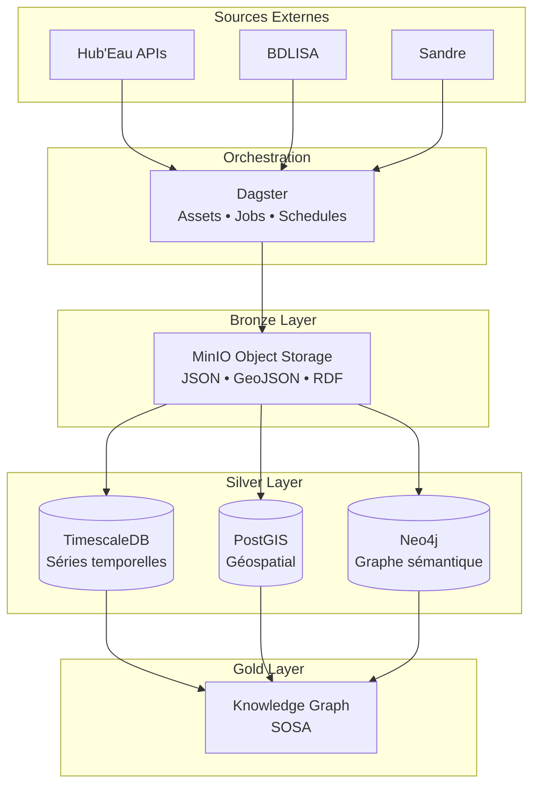

# Hub'Eau Data Integration Pipeline

Pipeline d'intégration des données hydrologiques françaises - Architecture Bronze/Silver/Gold avec Dagster

---

## Vue d'Ensemble

Pipeline intégrant **8 APIs Hub'Eau** avec gestion des erreurs, retry automatique, et limitation de concurrence pour protéger les APIs externes.

### Caractéristiques

- **8 APIs Hub'Eau** intégrées avec configurations optimisées
- **Architecture Medallion** : Bronze (MinIO) → Silver (DBs spécialisées) → Gold
- **Retry automatique** avec Tenacity (gestion erreurs HTTP)
- **Limitation de concurrence** (sémaphore global 10 requêtes max)
- **Partitions adaptées** par API : 2 quotidiennes, 5 annuelles, 1 non-partitionnée
- **0 troncature garantie** : Récupération complète de toutes les données

📖 **[Documentation Hub'Eau Complète](docs/HUBEAU_PIPELINE.md)**

---

## Architecture



### Stack Technologique

**Orchestration**
- Dagster 1.5+ : Pipeline, assets, jobs, schedules

**Bronze (Data Lake)**
- MinIO : Object Storage S3-compatible
- httpx : Client HTTP async
- tenacity : Retry automatique
- pydantic : Validation données

**Silver (Bases spécialisées)**
- TimescaleDB : Séries temporelles
- PostGIS : Données géospatiales
- Neo4j : Graphe sémantique

**Infrastructure**
- Docker Compose : Multi-container orchestration

---

## APIs Hub'Eau Intégrées

| API | Stations | Fréquence | Partitions | Restriction |
|-----|----------|-----------|------------|-------------|
| Hydrométrie | 10,943 | Temps réel | 30 derniers jours | API v2 limitée |
| Piézométrie | 24,871 | Horaire/Quotidienne | Depuis 2022 | - |
| Température | 849 | Sporadique | Depuis 2022 | - |
| Qualité Nappes | 52,472 | Trimestrielle | Depuis 2022 | - |
| Qualité Cours d'Eau | 20,000+ | Continue | Depuis 2022 | - |
| Hydrobiologie | 20,546 | Saisonnière | Depuis 2022 | - |
| ONDE | 3,548 | Mensuelle | Depuis 2022 | - |
| Prélèvements | National | Annuelle | Annuelles | - |

📖 [Documentation fréquences complètes](docs/HUBEAU_DATA_FREQUENCIES.md)

---

## Quick Start

### Prérequis

- Docker & Docker Compose
- 10 GB d'espace disque minimum
- Connexion Internet (accès APIs Hub'Eau)

### Installation

```bash
# Cloner le repository
git clone <repo>
cd brgm

# Configuration
cp env.example .env
# Éditer .env si nécessaire

# Démarrer les services
docker-compose up -d

# Vérifier l'état
docker-compose ps
```

### Accès aux Interfaces

| Service | URL | Identifiants |
|---------|-----|--------------|
| Dagster UI | http://localhost:8080 | - |
| MinIO Console | http://localhost:9001 | admin / BrgmMinio2024! |
| Neo4j Browser | http://localhost:7474 | neo4j / BrgmNeo4j2024! |
| pgAdmin | http://localhost:5050 | admin@brgm.fr / BrgmPgAdmin2024! |

---

## Structure du Projet

```
brgm/
├── src/hubeau_pipeline/
│   ├── assets/
│   │   ├── bronze/
│   │   │   ├── hubeau_client.py      # Client HTTP (httpx + tenacity)
│   │   │   ├── hubeau_configs.py     # Configurations APIs
│   │   │   ├── hubeau_assets.py      # Assets Dagster
│   │   │   └── legacy/
│   │   │       ├── bdlisa_real_ingestion.py
│   │   │       └── sandre_real_ingestion.py
│   │   ├── silver/                   # Transformations
│   │   └── gold/                     # Analytics
│   ├── jobs/
│   │   └── bronze_ingestion.py       # Jobs par thématique
│   ├── schedules/
│   │   └── schedules.py              # Planification
│   ├── sensors/
│   │   ├── data_freshness.py
│   │   └── error_detection.py
│   ├── resources.py                  # Connexions bases
│   └── definitions.py
│
├── docker/
│   ├── dagster/Dockerfile
│   └── init-scripts/                 # Scripts SQL/Cypher init
│
├── docs/                             # Documentation
├── dagster_home/
│   └── dagster.yaml                  # Config concurrence
├── docker-compose.yml
├── requirements.txt
└── README.md
```

---

## Configuration

### Limitation de Concurrence

**dagster_home/dagster.yaml** :
```yaml
run_coordinator:
  module: dagster.core.run_coordinator
  class: QueuedRunCoordinator
  config:
    max_concurrent_runs: 2
    tag_concurrency_limits:
      - key: "api"
        value: "hubeau"
        limit: 1  # Une partition Hub'Eau à la fois
```

**Résultat** : Protection contre surcharge des APIs Hub'Eau

### Buckets MinIO

```
bronze/   # Données brutes
  ├── hydrometry/2024-09-15/
  ├── piezometry/2024-09-15/
  ├── temperature/2024-08-15/
  └── ...

silver/   # Données transformées

gold/     # Agrégations
```

---

## Jobs Dagster

| Job | Description | APIs |
|-----|-------------|------|
| `hubeau_bronze_job` | APIs quotidiennes | 6 APIs |
| `hubeau_hydrometry_job` | Hydrométrie | Hydrométrie (30j) |
| `hubeau_environment_job` | Environnement | Température, ONDE, Hydrobio |
| `hubeau_water_quality_job` | Qualité eau | Cours d'eau + Nappes |
| `hubeau_prelevements_job` | Prélèvements | Prélèvements (annuel) |

### Lancer une Ingestion

```bash
# Via Dagster UI
http://localhost:8080 → Jobs → Launch Run

# Via CLI
docker-compose exec dagster_webserver dagster asset materialize \
  --select hubeau_piezometry_bronze \
  --partition 2024-09-15
```

### Backfill Historique

```bash
docker-compose exec dagster_webserver dagster asset materialize \
  --select hubeau_piezometry_bronze \
  --partition-range 2024-09-01:2024-09-30
```

**Note** : Les runs sont séquentiels (1 à la fois) pour protéger Hub'Eau

---

## Restrictions API

### Hydrométrie v2

```
Accès limité aux 30 derniers jours UNIQUEMENT
Erreur 400 si date < 30 jours
Source: API Hub'Eau v2
```

### Données Sporadiques

Certaines APIs ont des données intermittentes :
- **Température** : 50-80% des jours sans données
- **Hydrobiologie** : 70% des jours sans données (saisonnier)
- **Qualité Nappes** : 95%+ des jours sans données (trimestriel)

**Comportement normal** : Les agrégations se font en couches Silver/Gold

---

## Documentation

### Guides Principaux

- [📊 Fréquences de Mise à Jour](docs/HUBEAU_DATA_FREQUENCIES.md)
- [🌊 Sources de Données](docs/DATA_SOURCES_COMPLETE.md)
- [🏗️ Architecture Technique](docs/TECHNICAL_ARCHITECTURE.md)
- [💾 Stratégie de Stockage](docs/DATA_STORAGE_STRATEGY.md)
- [🚀 Architecture](docs/ARCHITECTURE_MODERNE.md)

### Documents de Référence

- [🔗 Vision SOSA/KG](docs/SOSA_FUTURE_VISION.md)
- [✅ Correctifs Hydrobiologie](docs/HYDROBIO_FIXES_COMPLETE.md)
- [🔍 Code Review](docs/CODE_REVIEW.md)

---

## Bases de Données

### Connexions Directes

| Base | Port | Utilisateur | Base de données |
|------|------|-------------|-----------------|
| TimescaleDB | 5432 | postgres | water_timeseries |
| PostGIS | 5433 | postgres | water_geo |
| Neo4j | 7687 | neo4j | neo4j |

### Initialisation

Les scripts d'initialisation sont dans `docker/init-scripts/` :
- TimescaleDB : Hypertables et compression
- PostGIS : Extensions spatiales et fonctions
- Neo4j : Contraintes et données Sandre/SOSA

---

## Ressources Externes

### Hub'Eau Officiel

- [Portail Hub'Eau](https://hubeau.eaufrance.fr/page/apis)
- [Documentation APIs](https://hubeau.eaufrance.fr/page/apis)

### Bibliothèques de Référence

- [cl-hubeau](https://tgrandje.github.io/cl-hubeau/) - Client Python référence
- [Dagster](https://docs.dagster.io/) - Documentation orchestration

### Open Data

- [data.gouv.fr - Hub'Eau](https://www.data.gouv.fr/dataservices/)

---

## License

MIT License