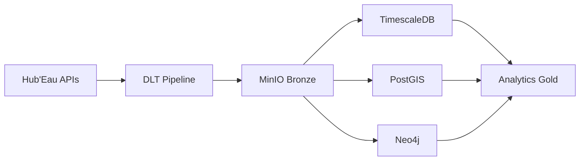

# Hub'Eau Data Integration Pipeline

Pipeline d'intégration des données Hub'Eau (8 APIs) avec architecture medallion et orchestration Dagster + DLT.

## 🏗️ Architecture Moderne



**Stack technique :**
- **Orchestration :** Dagster
- **Data Loading :** DLT (Data Load Tool)
- **Data Lake :** MinIO (S3-compatible)
- **Time Series :** TimescaleDB
- **Geospatial :** PostGIS
- **Graph :** Neo4j
- **Infrastructure :** Docker Compose

## 🚀 Installation Rapide

```bash
# Prérequis
docker-compose
python 3.11+

# Configuration
cp env.example .env
# Éditer .env avec les mots de passe

# Démarrage complet
docker-compose up -d

# Vérification
curl http://localhost:8080  # Dagster UI
curl http://localhost:9001  # MinIO
```

## 📊 APIs Hub'Eau Intégrées

| API | Endpoints | Partitioning |
|-----|-----------|--------------|
| **Hydrométrie** | stations, observations_tr | Daily |
| **Piézométrie** | stations, chroniques | Yearly |
| **Qualité Cours d'Eau** | stations, analyses | Yearly |
| **Qualité Eaux Souterraines** | stations, analyses | Yearly |
| **Température** | stations, chronique | Yearly |
| **ONDE (Écoulement)** | stations, observations | Daily |
| **Hydrobiologie** | stations, indices, taxons | Yearly |
| **Prélèvements** | stations, chroniques | Yearly |

## 🎯 Accès aux Services

- **Dagster UI :** http://localhost:8080
- **MinIO :** http://localhost:9001 (admin/your_minio_password)
- **TimescaleDB :** localhost:5432
- **PostGIS :** localhost:5433
- **Neo4j :** http://localhost:7474 (neo4j/your_neo4j_password)
- **pgAdmin :** http://localhost:5050

## 🔧 Configuration

Chaque API Hub'Eau a son fichier de configuration YAML dans `configs/hubeau/` qui définit les endpoints, la pagination et les stratégies d'ingestion optimisées.

## 🎮 Jobs Dagster

### Jobs par Type de Partition

```bash
# Données avec partitions ANNUELLES
dagster job execute -j sync_all_yearly_data

# Données avec partitions QUOTIDIENNES  
dagster job execute -j sync_all_daily_data

# Données temps réel (hydrométrie, écoulement)
dagster job execute -j sync_realtime_data
```

### Jobs par API Spécifique

```bash
# Température (partitions annuelles)
dagster job execute -j temperature_job

# Hydrométrie (partitions quotidiennes)
dagster job execute -j hydrometry_job

# Piézométrie (partitions annuelles)
dagster job execute -j piezometry_job
```

### Backfill par Partition

```bash
# Backfill température 2024
dagster asset materialize -a temperature_chroniques --partition 2024

# Backfill hydrométrie du 1er janvier 2024
dagster asset materialize -a hydrometry_observations --partition 2024-01-01
```

## 📁 Structure du Projet

```
hubeau_data_integration/
├── configs/hubeau/           # Configuration DLT par API
│   ├── temperature_chroniques.yml
│   ├── hydrometry_observations.yml
│   ├── piezometry_chroniques.yml
│   └── ...
├── pipelines/dlt/           # Pipeline DLT générique
│   ├── hubeau_generic.py    # Source DLT Hub'Eau
│   ├── slicing.py           # Logique de découpage
│   ├── http_client.py       # Client HTTP avec retry
│   └── schema.py            # Schémas de données
├── src/hubeau_pipeline/
│   ├── assets/bronze/       # Assets Dagster + DLT
│   ├── jobs/                # Jobs Dagster
│   ├── schedules/           # Planification
│   └── sensors/             # Monitoring
└── docker/                  # Configuration Docker
```

## 🔄 Flux de Données

### 1. **Stations de Référence**
```python
@asset(group_name="hubeau_temperature")
def temperature_stations_reference(context: AssetExecutionContext) -> Dict[str, Any]:
    """Récupère toutes les stations (~760 stations)"""
    return ingest_dlt(context, "configs/hubeau/temperature_stations.yml")
```

### 2. **Observations avec Filtrage Intelligent**
```python
@asset(group_name="hubeau_temperature", partitions_def=YEARLY_PARTITIONS, deps=[temperature_stations_reference])
def temperature_chroniques(context: AssetExecutionContext) -> Dict[str, Any]:
    """Filtre les stations actives et récupère les observations"""
    partition_date = _get_partition_date_yearly(context)  # "2024-01-01"
    stations_data, _ = _setup_observation_asset(context, "temperature", partition_date)
    # stations_data = stations filtrées (ex: 1 station active sur 760)
    return ingest_dlt(context, "configs/hubeau/temperature_chroniques.yml", stations_data=stations_data, partition_date=partition_date)
```

### 3. **Filtrage Automatique des Stations**
- **Test API** : Requête test pour identifier les stations avec données
- **Filtrage** : Seules les stations actives sont traitées
- **Optimisation** : Évite les requêtes inutiles (0 records)


## 🚨 Restrictions APIs Hub'Eau

- **Rate limiting** : 0.6-2.0 requêtes par seconde selon l'API
- **Timeout** : 60s par requête
- **Retry** : Backoff exponentiel (2s → 120s)
- **Concurrence** : Max 1 requête simultanée par API
- **Limites** : 20,000 records par requête globale

## 🔍 Monitoring et Debugging

### Logs Dagster
```bash
# Logs en temps réel
docker-compose logs -f dagster_daemon

# Logs spécifiques température
docker-compose logs dagster_daemon | grep temperature_chroniques
```

### Métriques DLT
- **Slices traités** : Progression des découpages
- **Records récupérés** : Volume de données par slice
- **Requêtes API** : Nombre et durée des appels
- **Fallbacks** : Détection des troncatures

### Debugging
```bash
# Test configuration DLT
python -c "from pipelines.dlt.hubeau_generic import test_config; test_config('configs/hubeau/temperature_chroniques.yml')"

# Vérification MinIO
docker-compose exec minio mc ls minio/bronze/
```

## 🛠️ Développement

### Ajouter une Nouvelle API

1. **Créer le fichier de config** : `configs/hubeau/nouvelle_api.yml`
2. **Définir l'asset Dagster** : `src/hubeau_pipeline/assets/bronze/dlt_assets.py`
3. **Ajouter au job** : `src/hubeau_pipeline/jobs/dlt_jobs.py`
4. **Tester** : `dagster job execute -j nouvelle_api_job`

### Modifier une Configuration DLT

1. **Éditer le YAML** : `configs/hubeau/api.yml`
2. **Tester localement** : `python pipelines/dlt/test_config.py`
3. **Déployer** : `git add . && git commit && git push gitlab main`
4. **Exécuter** : Dagster UI → Jobs → Execute

## 📚 Documentation Complète

- **[Tutoriel DLT](docs/TUTORIEL_DLT.md)** : Comprendre les fichiers de configuration
- **[Schémas d'Architecture](docs/ARCHITECTURE_SCHEMAS.md)** : Diagrammes Mermaid (medallion, stack, flux)
- **[Architecture Moderne](docs/ARCHITECTURE_MODERNE.md)** : Stack technique et choix architecturaux
- **[APIs Hub'Eau](docs/APIS_HUBEAU_COMPLETE.md)** : Documentation des APIs intégrées
- **[Stratégies de Stockage](docs/DATA_STORAGE_STRATEGY.md)** : Architecture medallion et bases de données

## 🤝 Contribution

**Dépôt principal :** [GitLab Université de Tours](https://scm.univ-tours.fr/ringuet/hubeau_data_integration)

**Workflow :**
1. Fork du projet
2. Créer une branche feature
3. Tests et validation
4. Pull Request vers main

## 📄 Licence

Ce projet est développé dans le cadre académique de l'Université de Tours.