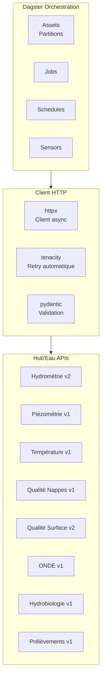
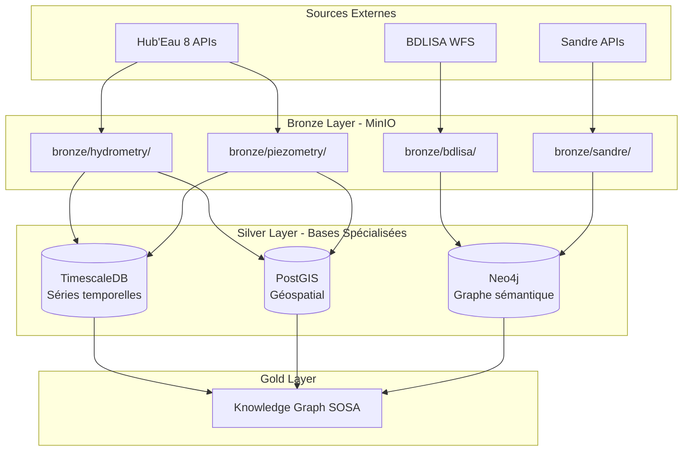

# Architecture Hub'Eau Pipeline

Documentation technique de l'architecture et de la stack utilisée

---

## Stack Technologique

### Orchestration et Ingestion



### Librairies Python

| Librairie | Version | Rôle |
|-----------|---------|------|
| dagster | 1.5+ | Orchestration pipeline |
| httpx | 0.24+ | Client HTTP async |
| tenacity | 8.2+ | Retry automatique |
| pydantic | 2.0+ | Validation données |
| boto3 | Latest | Client MinIO/S3 |

---

## Architecture de Données



---

## Structure du Code

```
src/hubeau_pipeline/
├── assets/
│   ├── bronze/
│   │   ├── hubeau_client.py          # Client HTTP avec retry
│   │   ├── hubeau_configs.py         # Configuration 8 APIs
│   │   ├── hubeau_assets.py          # Assets Dagster
│   │   ├── __init__.py
│   │   └── legacy/
│   │       ├── bdlisa_real_ingestion.py
│   │       ├── sandre_real_ingestion.py
│   │       └── README.md
│   ├── silver/
│   │   ├── timescale_complete.py
│   │   ├── postgis_neo4j.py
│   │   └── silver.py
│   └── gold/
│       ├── gold.py
│       └── production_analytics.py
├── jobs/
│   ├── bronze_ingestion.py           # Jobs par thématique
│   ├── analytics.py
│   └── __init__.py
├── schedules/
│   └── schedules.py                  # Planification temporelle
├── sensors/
│   ├── data_freshness.py
│   └── error_detection.py
├── resources.py                      # Connexions bases
├── utils.py
└── definitions.py                    # Point d'entrée Dagster
```

---

## Configuration des APIs

### Structure de Configuration

Toutes les configurations sont centralisées dans `hubeau_configs.py` :

```python
# hubeau_configs.py
class HubeauEndpointConfig:
    path: str                         # Chemin endpoint
    temporal_params: Dict[str, str]   # Paramètres temporels
    spatial_params: Dict[str, str]    # Paramètres spatiaux
    page_size: int                    # Taille page
    max_pages: int                    # Limite pages
    depth_limit: int                  # Limite records total
    requires_spatial_filter: bool     # Filtre spatial obligatoire
    supports_cursor: bool             # Pagination cursor
    cache_duration: int               # Durée cache (minutes)

class HubeauApiConfig:
    name: str
    base_url: str
    version: str
    endpoints: Dict[str, HubeauEndpointConfig]
```

### Exemple de Configuration

```python
# Configuration Piézométrie
piezometry_config = HubeauApiConfig(
    name="piezometry",
    base_url="https://hubeau.eaufrance.fr/api/v1/niveaux_nappes",
    version="v1",
    endpoints={
        "chroniques": HubeauEndpointConfig(
            path="chroniques",
            temporal_params={"start": "date_debut_mesure", "end": "date_fin_mesure"},
            page_size=1000,
            max_pages=50,
            depth_limit=50000,
            requires_spatial_filter=True,
            spatial_params={"dept": "code_departement"}
        )
    }
)
```

---

## Client HTTP

### Mécanisme de Retry

Le client utilise `tenacity` pour retry automatique :

```python
from tenacity import retry, stop_after_attempt, wait_exponential

@retry(
    stop=stop_after_attempt(5),
    wait=wait_exponential(multiplier=1, min=2, max=60),
    reraise=True
)
async def fetch_data(url: str, params: dict):
    async with httpx.AsyncClient(timeout=30.0) as client:
        response = await client.get(url, params=params)
        response.raise_for_status()
        return response.json()
```

**Paramètres** :
- 5 tentatives maximum
- Backoff exponentiel : 2s, 4s, 8s, 16s, 32s
- Timeout : 30 secondes par requête

### Gestion des Erreurs

| Code HTTP | Comportement |
|-----------|--------------|
| 400 | Retry (souvent lié aux dates) |
| 500 | Retry (surcharge temporaire) |
| Timeout | Retry |
| 200 | Succès |

---

## Partitionnement

### Types de Partitions

```python
# Partitions quotidiennes (depuis 2022)
DAILY_PARTITIONS = DailyPartitionsDefinition(
    start_date="2022-01-01"
)

# Hydrométrie : 30 derniers jours
HYDROMETRY_RECENT_PARTITIONS = DailyPartitionsDefinition(
    start_date=(datetime.now() - timedelta(days=29)).strftime("%Y-%m-%d"),
    end_offset=0
)

# Prélèvements : Annuelles
YEARLY_PARTITIONS = StaticPartitionsDefinition(
    ["2020", "2021", "2022", "2023", "2024", "2025"]
)
```

### Application par API

| API | Type Partition | Raison |
|-----|----------------|--------|
| Hydrométrie | 30 derniers jours | Restriction API v2 |
| Prélèvements | Annuelle | Déclarations annuelles |
| Autres APIs | Quotidienne depuis 2022 | Données temporelles |

---

## Jobs Dagster

### Structure des Jobs

```python
# jobs/bronze_ingestion.py

# Job principal (6 APIs quotidiennes)
hubeau_bronze_job = define_asset_job(
    name="hubeau_bronze_job",
    selection=[
        "hubeau_piezometry_bronze",
        "hubeau_temperature_bronze",
        "hubeau_hydrobiology_bronze",
        "hubeau_onde_bronze",
        "hubeau_water_quality_groundwater_bronze",
        "hubeau_water_quality_surface_bronze"
    ]
)

# Job Hydrométrie (partition spécifique)
hubeau_hydrometry_job = define_asset_job(
    name="hubeau_hydrometry_job",
    selection=["hubeau_hydrometry_bronze"]
)

# Job Prélèvements (partition annuelle)
hubeau_prelevements_job = define_asset_job(
    name="hubeau_prelevements_job",
    selection=["hubeau_prelevements_bronze"]
)
```

### Séparation des Jobs

**Raison** : Dagster impose partitions identiques au sein d'un job.

**Conséquence** : APIs avec partitions différentes = jobs séparés.

---

## Limitation de Concurrence

### Configuration Dagster

**dagster_home/dagster.yaml** :
```yaml
run_coordinator:
  module: dagster.core.run_coordinator
  class: QueuedRunCoordinator
  config:
    max_concurrent_runs: 2
    tag_concurrency_limits:
      - key: "api"
        value: "hubeau"
        limit: 1
```

### Comportement

- **Tag `api: hubeau`** : Tous les assets Hub'Eau
- **Limite 1** : Une partition à la fois
- **Résultat** : Backfill de 30 partitions = 30 runs séquentiels

**Objectif** : Protection API Hub'Eau contre surcharge

---

## Stockage MinIO

### Structure des Buckets

```
bronze/
  ├── hydrometry/
  │   └── 2024-09-15/
  │       ├── stations.json
  │       ├── observations_tr.json
  │       └── ingestion_metadata.json
  ├── piezometry/
  │   └── 2024-09-15/
  ├── temperature/
  ├── hydrobiology/
  ├── onde/
  ├── water_quality_groundwater/
  ├── water_quality_surface/
  ├── prelevements/
  ├── bdlisa/
  └── sandre/

silver/
  └── (données transformées)

gold/
  └── (agrégations)
```

### Métadonnées d'Ingestion

Chaque partition génère `ingestion_metadata.json` :

```json
{
  "execution_date": "2025-09-30T14:00:00",
  "partition_date": "2024-09-15",
  "api_name": "piezometry",
  "total_records_ingested": 25243,
  "status": "success",
  "endpoints": {
    "stations": 24871,
    "chroniques": 372
  }
}
```

---

## Bases de Données

### TimescaleDB

**Port** : 5432  
**Base** : `water_timeseries`

**Structure** :
```sql
CREATE TABLE observations (
    timestamp TIMESTAMPTZ NOT NULL,
    station_code TEXT,
    parametre_code TEXT,
    valeur DOUBLE PRECISION,
    qualite_code INT
);

SELECT create_hypertable('observations', 'timestamp');
```

### PostGIS

**Port** : 5433  
**Base** : `water_geo`

**Structure** :
```sql
CREATE TABLE stations_geo (
    station_code TEXT PRIMARY KEY,
    nom TEXT,
    geom GEOMETRY(Point, 4326)
);

CREATE INDEX idx_stations_geom ON stations_geo USING GIST(geom);
```

### Neo4j

**Ports** : 7474 (HTTP), 7687 (Bolt)  
**Base** : `neo4j`

**Structure** :
```cypher
(:Station)-[:OBSERVES]->(:Property)
(:Station)-[:LOCATED_IN]->(:Aquifer)
(:Property)-[:HAS_UNIT]->(:Unit)
```

---

## Docker Compose

### Services

```yaml
services:
  dagster_webserver:    # Interface Dagster (port 8080)
  dagster_daemon:       # Background orchestration
  timescaledb:          # Séries temporelles (port 5432)
  postgis:              # Géospatial (port 5433)
  neo4j:                # Graphe (ports 7474, 7687)
  minio:                # Object storage (ports 9000, 9001)
  pgadmin:              # Admin PostgreSQL (port 5050)
```

### Scripts d'Initialisation

```
docker/init-scripts/
├── timescaledb/
│   ├── 01-init-water-timeseries.sql
│   └── 02-create-hypertables.sql
├── postgis/
│   ├── 01-init-water-geo.sql
│   └── 02-create-functions.sql
└── neo4j/
    ├── 01-init-sandre-sosa.cypher
    ├── 02-create-sandre-data.cypher
    └── 03-create-relations-sosa.cypher
```

---

## Références

### Bibliothèques

- [httpx](https://www.python-httpx.org/) - Client HTTP async
- [tenacity](https://tenacity.readthedocs.io/) - Retry automatique
- [pydantic](https://docs.pydantic.dev/) - Validation données
- [Dagster](https://docs.dagster.io/) - Orchestration

### Hub'Eau

- [cl-hubeau](https://tgrandje.github.io/cl-hubeau/) - Client Python référence
- [Hub'Eau API](https://hubeau.eaufrance.fr/page/apis) - Documentation officielle

---

**Version** : 2.0  
**Dernière mise à jour** : Septembre 2025