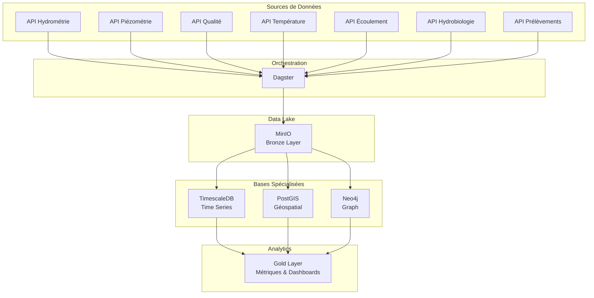
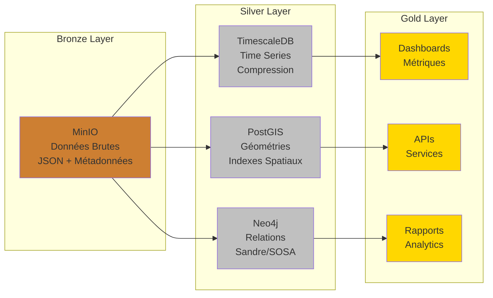
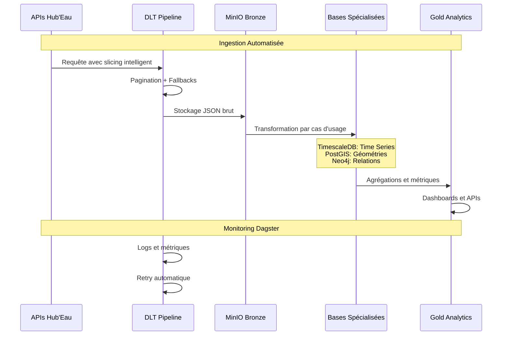
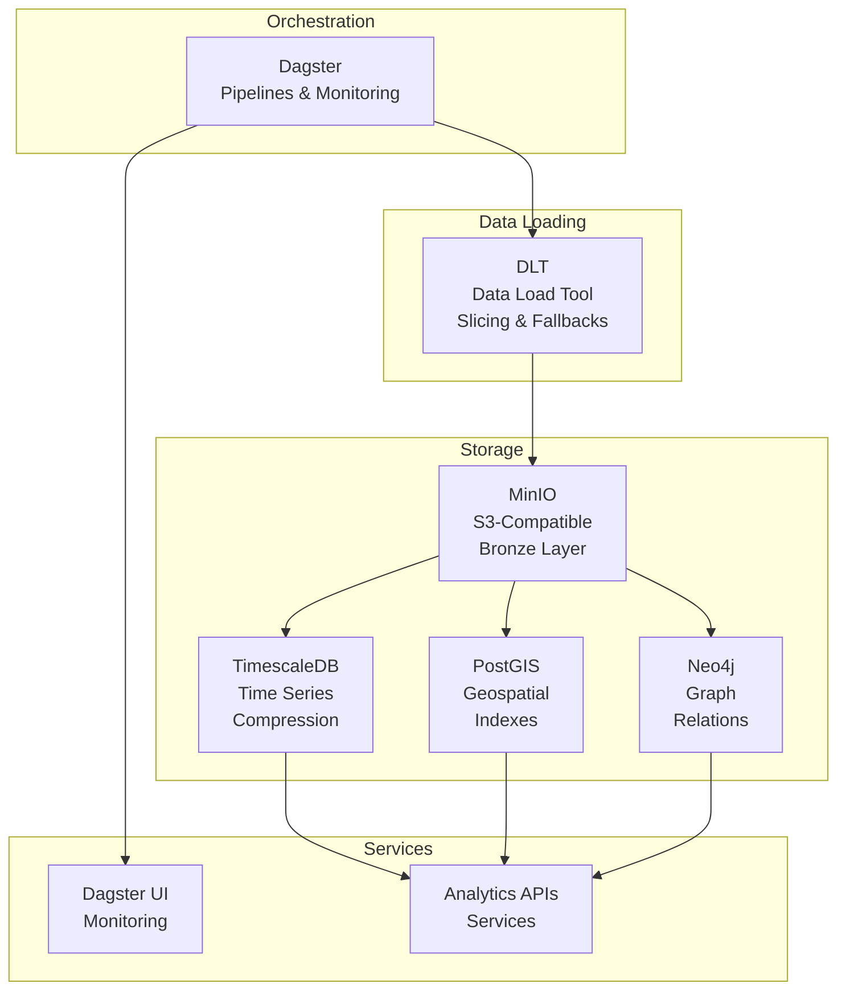

# Architecture Technique

## Vue d'Ensemble

## Choix Architecturaux

### Orchestration : Dagster
**Justification :** Pipeline complexe avec dépendances, retry automatique, monitoring intégré
- Assets déclaratifs avec lineage automatique
- Schedules et sensors pour automatisation
- UI intégrée pour monitoring et debugging
- Support natif des partitions temporelles

### Data Lake : MinIO
**Justification :** Stockage S3-compatible, coût réduit, intégration Docker native
- Compatible AWS S3 (migration future possible)
- Buckets organisés par couche (bronze/silver/gold)
- Versioning et lifecycle policies
- Accès programmatique via boto3

### Bases de Données Spécialisées

#### TimescaleDB (Time Series)
**Justification :** Optimisé pour données temporelles, compression automatique, requêtes analytiques
- Hypertables pour partitionnement temporel automatique
- Compression automatique sur données historiques
- Fonctions analytiques (LAG, LEAD, window functions)
- Indexes B-tree et BRIN optimisés

#### PostGIS (Geospatial)
**Justification :** Standard industriel, intégration PostgreSQL, performances spatiales
- Types géométriques natifs (POINT, LINESTRING, POLYGON)
- Indexes spatiaux (GIST, SP-GIST)
- Fonctions spatiales (ST_Distance, ST_Contains, ST_Intersects)
- Support projections cartographiques multiples

#### Neo4j (Graph)
**Justification :** Modélisation relationnelle complexe, requêtes graph efficaces
- Modèle Sandre/SOSA avec relations sémantiques
- Requêtes Cypher pour traversées de graphe
- Indexes sur propriétés et relations
- Contraintes d'unicité et intégrité

## Architecture Medallion

### Bronze Layer (MinIO)
**Rôle :** Stockage des données brutes Hub'Eau
- Format JSON préservant structure originale
- Partitioning par API et date
- Métadonnées d'ingestion (timestamps, counts, errors)
- Pas de transformation, données "as-is"

### Silver Layer (Specialized DBs)
**Rôle :** Données transformées et optimisées par cas d'usage
- **TimescaleDB :** Time series avec compression
- **PostGIS :** Géométries et requêtes spatiales
- **Neo4j :** Relations sémantiques Sandre/SOSA
- Schémas optimisés pour requêtes analytiques

### Gold Layer (Analytics)
**Rôle :** Agrégations et métriques métier
- Vues matérialisées pour performances
- Indicateurs de qualité des données
- Dashboards et rapports pré-calculés
- APIs pour applications consommatrices

## Flux de Données avec DLT

## Stack Technologique

