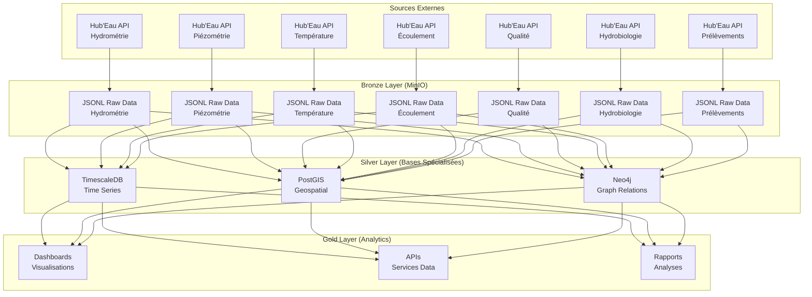
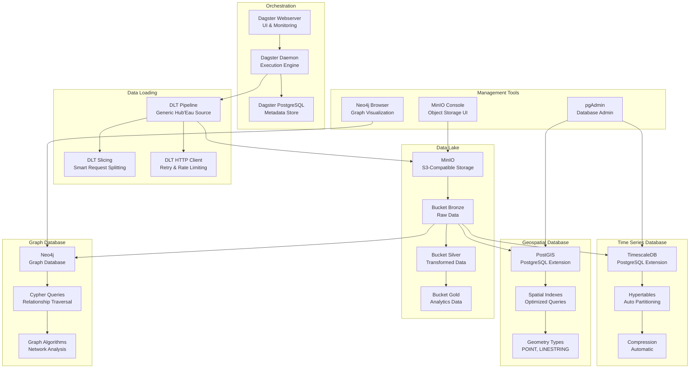
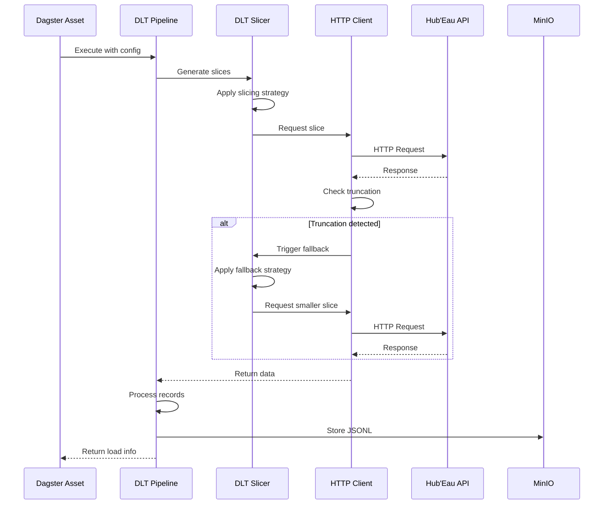
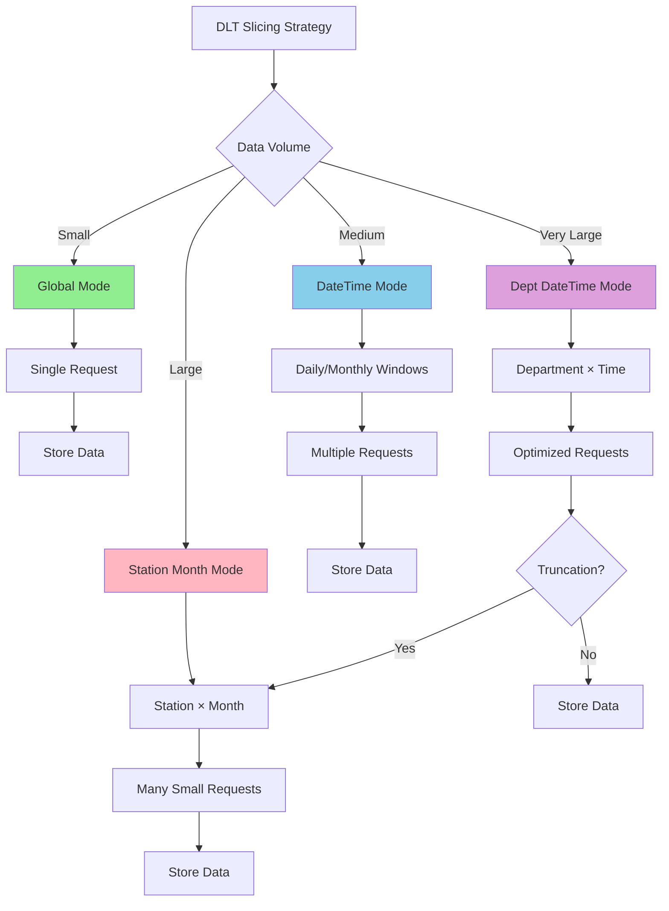

# Schémas d'Architecture

## Architecture Medallion (Couches de Données)

```mermaid
graph TB
    subgraph "Sources Externes"
        H1[Hub'Eau API<br/>Hydrométrie]
        H2[Hub'Eau API<br/>Piézométrie]
        H3[Hub'Eau API<br/>Qualité]
        H4[Hub'Eau API<br/>Température]
        H5[Hub'Eau API<br/>Écoulement]
        H6[Hub'Eau API<br/>Hydrobiologie]
        H7[Hub'Eau API<br/>Prélèvements]
    end

    subgraph "Bronze Layer (MinIO)"
        B1[JSONL Raw Data<br/>Hydrométrie]
        B2[JSONL Raw Data<br/>Piézométrie]
        B3[JSONL Raw Data<br/>Qualité]
        B4[JSONL Raw Data<br/>Température]
        B5[JSONL Raw Data<br/>Écoulement]
        B6[JSONL Raw Data<br/>Hydrobiologie]
        B7[JSONL Raw Data<br/>Prélèvements]
    end

    subgraph "Silver Layer (Bases Spécialisées)"
        S1[TimescaleDB<br/>Time Series]
        S2[PostGIS<br/>Geospatial]
        S3[Neo4j<br/>Graph Relations]
    end

    subgraph "Gold Layer (Analytics)"
        G1[Dashboards<br/>Visualisations]
        G2[APIs<br/>Services Data]
        G3[Rapports<br/>Analyses]
    end

    H1 --> B1
    H2 --> B2
    H3 --> B3
    H4 --> B4
    H5 --> B5
    H6 --> B6
    H7 --> B7

    B1 --> S1
    B2 --> S1
    B4 --> S1
    B5 --> S1

    B1 --> S2
    B2 --> S2
    B3 --> S2
    B4 --> S2
    B5 --> S2
    B6 --> S2
    B7 --> S2

    B1 --> S3
    B2 --> S3
    B3 --> S3
    B4 --> S3
    B5 --> S3
    B6 --> S3
    B7 --> S3

    S1 --> G1
    S2 --> G1
    S3 --> G1

    S1 --> G2
    S2 --> G2
    S3 --> G2

    S1 --> G3
    S2 --> G3
    S3 --> G3
```

## Stack Technique Complète

```mermaid
graph TB
    subgraph "Orchestration"
        D1[Dagster Webserver<br/>UI & Monitoring]
        D2[Dagster Daemon<br/>Execution Engine]
        D3[Dagster PostgreSQL<br/>Metadata Store]
    end

    subgraph "Data Loading"
        DL1[DLT Pipeline<br/>Generic Hub'Eau Source]
        DL2[DLT Slicing<br/>Smart Request Splitting]
        DL3[DLT HTTP Client<br/>Retry & Rate Limiting]
    end

    subgraph "Data Lake"
        M1[MinIO<br/>S3-Compatible Storage]
        M2[Bucket Bronze<br/>Raw Data]
        M3[Bucket Silver<br/>Transformed Data]
        M4[Bucket Gold<br/>Analytics Data]
    end

    subgraph "Time Series Database"
        T1[TimescaleDB<br/>PostgreSQL Extension]
        T2[Hypertables<br/>Auto Partitioning]
        T3[Compression<br/>Automatic]
    end

    subgraph "Geospatial Database"
        P1[PostGIS<br/>PostgreSQL Extension]
        P2[Spatial Indexes<br/>Optimized Queries]
        P3[Geometry Types<br/>POINT, LINESTRING]
    end

    subgraph "Graph Database"
        N1[Neo4j<br/>Graph Database]
        N2[Cypher Queries<br/>Relationship Traversal]
        N3[Graph Algorithms<br/>Network Analysis]
    end

    subgraph "Management Tools"
        PG1[pgAdmin<br/>Database Admin]
        PG2[Neo4j Browser<br/>Graph Visualization]
        PG3[MinIO Console<br/>Object Storage UI]
    end

    D1 --> D2
    D2 --> D3
    D2 --> DL1
    DL1 --> DL2
    DL1 --> DL3
    DL1 --> M1
    M1 --> M2
    M2 --> M3
    M3 --> M4
    M2 --> T1
    M2 --> P1
    M2 --> N1
    T1 --> T2
    T2 --> T3
    P1 --> P2
    P2 --> P3
    N1 --> N2
    N2 --> N3
    PG1 --> T1
    PG1 --> P1
    PG2 --> N1
    PG3 --> M1
```

## Flux de Données DLT

```mermaid
sequenceDiagram
    participant D as Dagster Asset
    participant DL as DLT Pipeline
    participant S as DLT Slicer
    participant H as HTTP Client
    participant API as Hub'Eau API
    participant M as MinIO

    D->>DL: Execute with config
    DL->>S: Generate slices
    S->>S: Apply slicing strategy
    S->>H: Request slice
    H->>API: HTTP Request
    API-->>H: Response
    H->>H: Check truncation
    alt Truncation detected
        H->>S: Trigger fallback
        S->>S: Apply fallback strategy
        S->>H: Request smaller slice
        H->>API: HTTP Request
        API-->>H: Response
    end
    H-->>DL: Return data
    DL->>DL: Process records
    DL->>M: Store JSONL
    DL-->>D: Return load info
```

## Stratégies de Slicing DLT

```mermaid
graph TD
    A[DLT Slicing Strategy] --> B{Data Volume}
    
    B -->|Small| C[Global Mode]
    B -->|Medium| D[DateTime Mode]
    B -->|Large| E[Station Month Mode]
    B -->|Very Large| F[Dept DateTime Mode]
    
    C --> C1[Single Request]
    C1 --> C2[Store Data]
    
    D --> D1[Daily/Monthly Windows]
    D1 --> D2[Multiple Requests]
    D2 --> D3[Store Data]
    
    E --> E1[Station × Month]
    E1 --> E2[Many Small Requests]
    E2 --> E3[Store Data]
    
    F --> F1[Department × Time]
    F1 --> F2[Optimized Requests]
    F2 --> F3{Truncation?}
    F3 -->|Yes| E1
    F3 -->|No| F4[Store Data]
    
    style C fill:#90EE90
    style D fill:#87CEEB
    style E fill:#FFB6C1
    style F fill:#DDA0DD
```

## Jobs Dagster par Partition

```mermaid
graph TB
    subgraph "Daily Partitions"
        DP1[Hydrométrie<br/>Observations]
        DP2[Écoulement<br/>Observations]
    end

    subgraph "Yearly Partitions"
        YP1[Piézométrie<br/>Chroniques]
        YP2[Qualité Cours d'Eau<br/>Analyses]
        YP3[Qualité Eaux Souterraines<br/>Analyses]
        YP4[Température<br/>Chroniques]
        YP5[Hydrobiologie<br/>Indices & Taxons]
        YP6[Prélèvements<br/>Chroniques]
    end

    subgraph "No Partitions (Reference)"
        RP1[Hydrométrie<br/>Stations]
        RP2[Piézométrie<br/>Stations]
        RP3[Qualité<br/>Stations]
        RP4[Température<br/>Stations]
        RP5[Écoulement<br/>Stations]
        RP6[Hydrobiologie<br/>Stations]
        RP7[Prélèvements<br/>Stations]
    end

    subgraph "Jobs"
        J1[sync_all_daily_data]
        J2[sync_all_yearly_data]
        J3[sync_all_stations]
    end

    J1 --> DP1
    J1 --> DP2
    
    J2 --> YP1
    J2 --> YP2
    J2 --> YP3
    J2 --> YP4
    J2 --> YP5
    J2 --> YP6
    
    J3 --> RP1
    J3 --> RP2
    J3 --> RP3
    J3 --> RP4
    J3 --> RP5
    J3 --> RP6
    J3 --> RP7

    style DP1 fill:#E6F3FF
    style DP2 fill:#E6F3FF
    style YP1 fill:#FFF2E6
    style YP2 fill:#FFF2E6
    style YP3 fill:#FFF2E6
    style YP4 fill:#FFF2E6
    style YP5 fill:#FFF2E6
    style YP6 fill:#FFF2E6
    style RP1 fill:#F0F8F0
    style RP2 fill:#F0F8F0
    style RP3 fill:#F0F8F0
    style RP4 fill:#F0F8F0
    style RP5 fill:#F0F8F0
    style RP6 fill:#F0F8F0
    style RP7 fill:#F0F8F0
```
