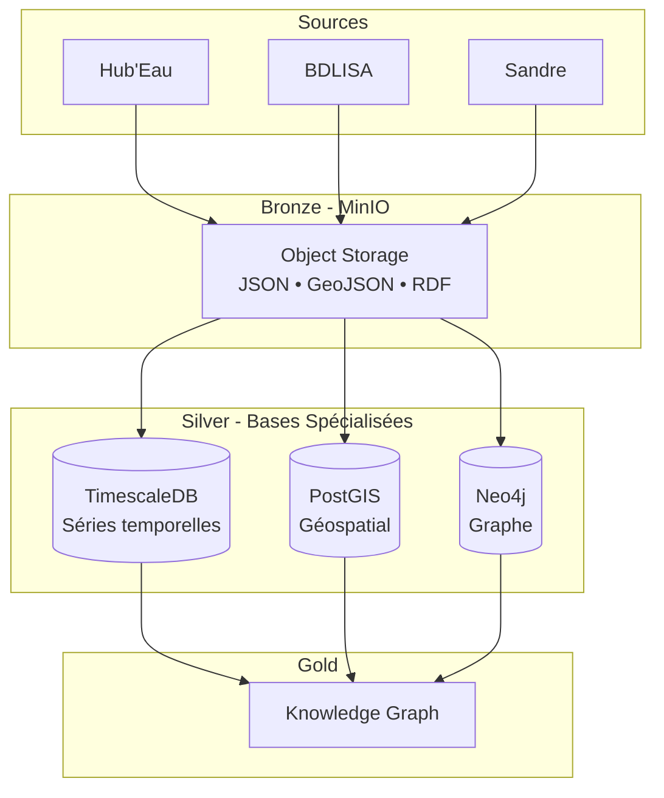

# Stratégie de Stockage des Données

Architecture Medallion Bronze → Silver → Gold

---

## Architecture



---

## Bronze Layer : MinIO

### Structure

```
bronze/
  ├── hydrometry/
  │   └── 2024-09-15/
  │       ├── stations.json
  │       ├── observations_tr.json
  │       └── ingestion_metadata.json
  ├── piezometry/2024-09-15/
  ├── temperature/2024-08-15/
  ├── hydrobiology/2024-09-15/
  ├── onde/2024-09-15/
  ├── water_quality_groundwater/2024-09-15/
  ├── water_quality_surface/2024-09-15/
  ├── prelevements/2024/
  ├── bdlisa/
  └── sandre/

silver/
  └── (données transformées)

gold/
  └── (agrégations)
```

### Caractéristiques

- **S3-compatible** : Migration cloud possible
- **Formats multiples** : JSON, GeoJSON, RDF
- **Partitionnement** : Par date (quotidien/annuel)
- **Métadonnées** : Fichier `ingestion_metadata.json` par partition

---

## Silver Layer : Bases Spécialisées

### TimescaleDB - Séries Temporelles

**Rôle** : Observations et mesures temporelles

**Structure** :
```sql
CREATE TABLE observations (
    timestamp TIMESTAMPTZ NOT NULL,
    station_code TEXT,
    parametre_code TEXT,
    valeur DOUBLE PRECISION,
    qualite_code INT
);

SELECT create_hypertable('observations', 'timestamp');

-- Compression automatique
ALTER TABLE observations SET (
    timescaledb.compress,
    timescaledb.compress_segmentby = 'station_code,parametre_code'
);
```

**Fonctionnalités** :
- Partitioning automatique par temps
- Compression (90% réduction stockage)
- Continuous aggregates
- Compatible PostgreSQL

**Cas d'usage** :
- Agrégations temporelles (moyennes, tendances)
- Tableaux de bord temps réel
- Exports BI/reporting

---

### PostGIS - Données Géospatiales

**Rôle** : Stations et formations géologiques

**Structure** :
```sql
CREATE TABLE stations_geo (
    station_code TEXT PRIMARY KEY,
    nom TEXT,
    type_station TEXT,
    geom GEOMETRY(Point, 4326),
    altitude DOUBLE PRECISION
);

CREATE INDEX idx_stations_geom ON stations_geo USING GIST(geom);

CREATE TABLE formations_aquiferes (
    code_bdlisa TEXT PRIMARY KEY,
    nom_formation TEXT,
    geometry GEOMETRY(MultiPolygon, 4326)
);
```

**Fonctionnalités** :
- Index GIST pour requêtes spatiales
- Fonctions géométriques (distance, intersection, buffer)
- Standards OGC (WFS, WMS)
- Interopérabilité (QGIS, ArcGIS)

**Cas d'usage** :
- Analyses spatiales (proximité, intersection)
- Cartes et visualisations
- Relations territoriales (stations ↔ formations)

---

### Neo4j - Graphe Sémantique

**Rôle** : Nomenclatures et ontologies

**Structure** :
```cypher
// Contraintes
CREATE CONSTRAINT station_code FOR (s:Station) 
REQUIRE s.code IS UNIQUE;

// Modèle SOSA
(:Station)-[:OBSERVES]->(:Property)
(:Station)-[:LOCATED_IN]->(:Aquifer)
(:Property)-[:HAS_UNIT]->(:Unit)
(:Property)-[:PART_OF]->(:Thesaurus)

// Nomenclature Sandre
(:Parameter {code: "1301", nom: "Température"})
  -[:BELONG_TO_FAMILY]->(:Family {nom: "Physico-chimie"})
  -[:HAS_UNIT]->(:Unit {code: "°C"})
```

**Fonctionnalités** :
- Traversals graphe (performance linéaire)
- Schéma flexible
- Relations sémantiques
- APOC (extensions)

**Cas d'usage** :
- Thésaurus Sandre
- Modèle SOSA (capteurs, observations)
- Découverte de patterns
- Relations conceptuelles

---

## Gold Layer : Knowledge Graph

**Objectif** : Vue unifiée cross-sources

**Composants** :
- Knowledge Graph SOSA complet
- API GraphQL fédérée (future)
- Vues matérialisées
- Cache multi-niveaux (future)

**Exemple requête unifiée** :
```graphql
query StationCompleteInfo($code: String!) {
  station(code: $code) {
    # Métadonnées (Neo4j)
    name, type, installation_date
    observed_properties { name, unit }
    
    # Séries temporelles (TimescaleDB)
    timeseries(period: "1M") {
      timestamp, value, quality
    }
    
    # Contexte spatial (PostGIS)
    spatial {
      aquifer_name, formation_type
      nearby_stations(radius: 10km) {
        code, distance
      }
    }
  }
}
```

---

## Intégration Cross-Sources

### Référencement

**Principe** : Liaison via `station_code` unique

```python
# TimescaleDB
SELECT timestamp, station_code, valeur 
FROM observations 
WHERE station_code = 'BSS001234567';

# PostGIS (même station_code)
SELECT nom, geom, formation_type 
FROM stations_geo 
WHERE station_code = 'BSS001234567';

# Neo4j (même code)
MATCH (s:Station {code: 'BSS001234567'})
      -[:OBSERVES]->(p:Property)
RETURN p.nom, p.unit;
```

### Synchronisation

- Asset Dagster pour cohérence
- Validation intégrité références
- Mise à jour automatique métadonnées

---

## Choix Architecturaux

### Pourquoi 3 Bases ?

| Type Requête | Base | Raison |
|--------------|------|--------|
| Moyenne temporelle | TimescaleDB | Hypertables + compression |
| Proximité spatiale | PostGIS | Index GIST + géométrie |
| Relations sémantiques | Neo4j | Traversal graphe |

**Performance** :
- TimescaleDB : 1000x plus rapide pour agrégations temporelles
- PostGIS : 100x plus rapide pour requêtes spatiales
- Neo4j : Performance linéaire vs exponentielle SQL

### Pourquoi MinIO ?

- S3-compatible (standard industrie)
- Self-hosted (pas de coûts cloud)
- Performance excellente
- Déploiement Docker simple

---

## Gouvernance

### Rétention

| Couche | Durée | Raison |
|--------|-------|--------|
| Bronze | 2 ans | Données brutes archivage |
| Silver | 10 ans | Données opérationnelles |
| Métadonnées | Permanent | Référence |

### Backup

```bash
# TimescaleDB
pg_dump -U postgres -d water_timeseries > backup.sql

# PostGIS
pg_dump -U postgres -d water_geo > backup.sql

# Neo4j
docker exec neo4j neo4j-admin database dump water_graph

# MinIO
mc mirror minio/bronze /backups/bronze
```

---

## Références

- [MinIO](https://min.io/docs/)
- [TimescaleDB](https://docs.timescale.com/)
- [PostGIS](https://postgis.net/documentation/)
- [Neo4j](https://neo4j.com/docs/)
- [SOSA/SSN](https://www.w3.org/TR/vocab-ssn/)

---

**Version** : 2.0  
**Dernière mise à jour** : Septembre 2025

