# Schéma Relationnel Complet Hub'Eau

> **Modèle de données relationnel avec clés primaires et étrangères**  
> **Date** : 2025-10-13  
> **Version** : 2.0

## 📑 Table des Matières

1. [Notation et Conventions](#-notation-et-conventions)
2. [Architecture de Stockage](#-architecture-de-stockage)
3. [Référentiels Centraux](#-référentiels-centraux)
4. [Entités Géographiques](#-entités-géographiques)
5. [Schéma Hydrométrie](#-schéma-hydrométrie)
6. [Schéma Piézométrie](#-schéma-piézométrie)
7. [Schéma Qualité Cours d'Eau](#-schéma-qualité-cours-deau)
8. [Schéma Qualité Nappes](#-schéma-qualité-nappes)
9. [Schéma Température](#-schéma-température)
10. [Schéma Écoulement](#-schéma-écoulement)
11. [Schéma Hydrobiologie](#-schéma-hydrobiologie)
12. [Schéma Prélèvements](#-schéma-prélèvements)
13. [Schéma Intégré Global](#-schéma-intégré-global)
14. [Tables de Référence Complètes](#-tables-de-référence-complètes)

---

## 📋 Notation et Conventions

- **PK** : Clé Primaire (Primary Key)
- **FK** : Clé Étrangère (Foreign Key)
- **→** : Relation FK vers PK
- **1:N** : Un à plusieurs
- **N:N** : Plusieurs à plusieurs
- **array** : Champ tableau (PostgreSQL)

---

## 🏗️ Architecture de Stockage

### Vue d'Ensemble

Le système Hub'Eau comporte différents types de données nécessitant des paradigmes de stockage adaptés. Cette section analyse les besoins techniques pour chaque catégorie.

### Analyse par Type de Données

#### 1. **SANDRE - Référentiels de Nomenclatures**

**Données** : Paramètres, Unités, Qualifications, Supports, Méthodes, Taxons

**Cas d'usage réels** :
```sql
-- 99% des requêtes SANDRE ressemblent à ça :
SELECT libelle_parametre, symbole_unite
FROM analyses 
JOIN sandre_parametres USING (code_parametre)
JOIN sandre_unites USING (code_unite)
WHERE code_station = 'X' AND date > '2024-01-01';

-- Ou ça (hiérarchie taxonomique) :
WITH RECURSIVE taxon_hierarchy AS (
    SELECT code_taxon, libelle_taxon, code_parent, 1 as niveau
    FROM sandre_taxons WHERE code_taxon = '12345'
    UNION ALL
    SELECT t.code_taxon, t.libelle_taxon, t.code_parent, h.niveau + 1
    FROM sandre_taxons t
    JOIN taxon_hierarchy h ON t.code_taxon = h.code_parent
)
SELECT * FROM taxon_hierarchy;
```

**Comparaison PostgreSQL vs Neo4j** :

| Critère | PostgreSQL | Neo4j |
|---------|-----------|-------|
| **Lookups simples** (code → libellé) | Index B-tree : 5-10ms | Index natif : 2-5ms (gain marginal) |
| **Jointures FK massives** | Hash joins optimisés | Traversal natif |
| **Hiérarchies (3-4 niveaux)** | CTE récursive : 10-50ms | Pattern matching : 5-20ms (gain marginal) |
| **Complexité opérationnelle** | Infrastructure existante | Infrastructure supplémentaire |
| **Coût infrastructure** | Inclus dans PostgreSQL | Service séparé (RAM, CPU, formation) |

**Analyse** :

Les cas d'usage SANDRE sont principalement :
- Lookups FK (code → libellé) : ~99% des requêtes
- Hiérarchies taxonomiques : 3-4 niveaux maximum
- Jointures massives avec tables d'analyses

PostgreSQL gère ces cas avec :
- Index B-tree : 5-10ms pour lookups
- CTEs récursives : 10-50ms pour hiérarchies

Neo4j offrirait :
- Index natif : 2-5ms pour lookups (gain marginal)
- Pattern matching : 5-20ms pour hiérarchies (gain marginal)
- Coût : Infrastructure supplémentaire à gérer

**Recommandation** : **PostgreSQL** (infrastructure existante suffisante)

Neo4j devient pertinent pour :
- Parcours de graphe > 5 niveaux de profondeur
- Découverte de chemins (pathfinding)
- Détection de communautés
- Recommandations par similarité de graphe

Ces cas d'usage ne sont pas présents dans les données Hub'Eau actuelles.

---

#### 2. **BDLISA - Formations Géologiques**

**Données** : Codes formations, noms, lithologie, productivité

**Cas d'usage réels** :
```sql
-- Trouver les formations d'un piézomètre
SELECT f.nom_formation, f.lithologie, f.productivite
FROM piezometrie_stations s
JOIN piezometrie_stations_bdlisa sb ON s.code_bss = sb.code_bss
JOIN bdlisa_formations f ON sb.code_bdlisa = f.code_bdlisa
WHERE s.code_bss = '08225X0037/F';

-- Relations spatiales (formations qui se superposent)
SELECT f1.nom_formation, f2.nom_formation
FROM bdlisa_formations f1
JOIN bdlisa_formations f2 ON ST_Overlaps(f1.geometry, f2.geometry)
WHERE f1.code_bdlisa = 'XXX';
```

**Comparaison PostgreSQL + PostGIS vs Neo4j** :

| Critère | PostgreSQL + PostGIS | Neo4j |
|---------|---------------------|-------|
| **Relations N:N** (stations ↔ formations) | Tables de liaison standard | Relations natives |
| **Relations spatiales** | ST_Overlaps, ST_Contains, ST_Intersects | Support spatial limité (points uniquement) |
| **Hiérarchies géologiques** | CTE récursive ou LTREE | Pattern matching |

**Analyse** :

Les cas d'usage BDLISA incluent :
- Relations N:N (stations ↔ formations géologiques)
- Relations spatiales (superposition, intersection de polygones)
- Requêtes sur attributs (lithologie, productivité)

PostGIS offre :
- Fonctions spatiales natives (ST_Overlaps, ST_Contains, ST_Intersects)
- Index GIST pour performance spatiale
- Support PostgreSQL standard

Neo4j :
- Relations N:N natives
- Pas de support spatial équivalent à PostGIS

**Recommandation** : **PostgreSQL + PostGIS** (requêtes spatiales nécessaires)

---

#### 3. **Stations - Métadonnées Spatiales**

**Données** : Stations hydrométrie, piézométrie, qualité, etc.

**Cas d'usage réels** :
```sql
-- Trouver les stations dans un rayon de 5km
SELECT code_station, libelle_station,
       ST_Distance(geometry::geography, 
                   ST_SetSRID(ST_MakePoint(2.3488, 48.8534), 4326)::geography) AS distance_m
FROM hydrometrie_stations
WHERE ST_DWithin(geometry::geography, 
                 ST_SetSRID(ST_MakePoint(2.3488, 48.8534), 4326)::geography, 
                 5000)
ORDER BY distance_m;

-- Stations dans un département
SELECT code_station FROM hydrometrie_stations WHERE code_departement = '69';

-- Stations sur un cours d'eau
SELECT code_station FROM hydrometrie_stations WHERE code_cours_eau = 'V---0000';
```

**Analyse** :

Les cas d'usage stations incluent :
- Recherche par rayon géographique
- Requêtes par département/commune
- Requêtes par cours d'eau
- Jointures spatiales

PostGIS offre :
- Index GIST sur géométries
- Fonctions ST_DWithin, ST_Distance, ST_Buffer
- Performance < 100ms avec index appropriés

**Recommandation** : **PostgreSQL + PostGIS** (standard industrie pour données géospatiales)

**Configuration** :
```sql
CREATE INDEX idx_stations_geom ON hydrometrie_stations USING GIST (geometry);
CREATE INDEX idx_stations_dept ON hydrometrie_stations (code_departement);
CREATE INDEX idx_stations_cours_eau ON hydrometrie_stations (code_cours_eau);
```

---

#### 4. **Chroniques / Observations - Séries Temporelles**

**Données** : Millions de mesures (débits, niveaux, analyses, températures)

**Volume estimé** :
- Hydrométrie : ~50M mesures/an
- Piézométrie : ~10M mesures/an
- Qualité : ~5M analyses/an
- **Total** : ~65M lignes/an × 10 ans = **650M lignes**

**Cas d'usage réels** :
```sql
-- Tendance sur 5 ans
SELECT time_bucket('1 month', date_obs) AS mois,
       AVG(resultat) AS moyenne
FROM hydrometrie_obs_elab
WHERE code_station = 'K4470010' 
  AND date_obs >= NOW() - INTERVAL '5 years'
GROUP BY mois;

-- Agrégations mensuelles par bassin
SELECT code_bassin, date_trunc('month', date_obs) AS mois,
       AVG(resultat) AS debit_moyen
FROM hydrometrie_obs_elab
JOIN hydrometrie_stations USING (code_station)
GROUP BY code_bassin, mois;
```

**Comparaison PostgreSQL natif vs TimescaleDB** :

| Critère | PostgreSQL natif | TimescaleDB |
|---------|-----------------|-------------|
| **Partitionnement temporel** | `PARTITION BY RANGE (date)` Manuel | Automatique par chunk |
| **Compression** | Manuel (pg_squeeze) ou aucune | Automatique 10-20x |
| **Agrégations continues** | Materialized Views refresh manuel | Continuous Aggregates auto-refresh |
| **Retention policies** | Script cron DELETE | Automatique (add_retention_policy) |
| **Performance requêtes** | Bon avec partitionnement et index | Optimisé pour time-series |
| **Complexité** | PostgreSQL standard | Extension PostgreSQL |
| **Compatibilité SQL** | 100% PostgreSQL | 99% PostgreSQL |

**Analyse par volume** :

**< 100M lignes** : PostgreSQL natif
```sql
-- Partitionnement natif (simple et efficace)
CREATE TABLE hydrometrie_obs_elab (
    code_station TEXT,
    date_obs TIMESTAMPTZ,
    grandeur_hydro TEXT,
    resultat DOUBLE PRECISION
) PARTITION BY RANGE (date_obs);

CREATE TABLE hydrometrie_obs_elab_2024_01 
    PARTITION OF hydrometrie_obs_elab
    FOR VALUES FROM ('2024-01-01') TO ('2024-02-01');
-- Créer une partition par mois
```

**> 100M lignes** : TimescaleDB
```sql
-- Configuration TimescaleDB pour gros volumes
SELECT create_hypertable('hydrometrie_obs_elab', 'date_obs');
SELECT add_compression_policy('hydrometrie_obs_elab', INTERVAL '7 days');
SELECT add_retention_policy('hydrometrie_obs_elab', INTERVAL '10 years');
```

**Bénéfices TimescaleDB** :
- Compression automatique : 10-20x
- Agrégations continues (continuous aggregates)
- Gestion automatique de la rétention
- Compatible PostgreSQL (extension)

**Recommandation** : PostgreSQL natif initialement, TimescaleDB si volume > 100M lignes

---

#### 5. **Object Storage (Bronze Layer)**

**Données** : Parquet bruts depuis APIs

**Comparaison AWS S3 vs MinIO** :

| Critère | AWS S3 | MinIO |
|---------|--------|-------|
| **Coût** | ~$0.023/GB/mois | Gratuit (self-hosted) |
| **Maintenance** | Service managé | Infrastructure à gérer |
| **Performance** | Excellent | Excellent |
| **Compatibilité** | S3 API natif | Compatible S3 API |
| **Souveraineté données** | USA/EU selon région | On-premise |

**Recommandation** : 
- **MinIO** pour infrastructure on-premise (coût, souveraineté)
- **S3** pour infrastructure cloud (simplicité opérationnelle)

**Format de stockage** : **Apache Parquet** (columnar, compressé, schéma)

---

#### 6. **Analytics (Gold Layer)**

**Cas d'usage** : Dashboards, rapports, BI ad-hoc

**Comparaison PostgreSQL vs ClickHouse vs DuckDB** :

| Critère | PostgreSQL | ClickHouse | DuckDB |
|---------|-----------|------------|--------|
| **Agrégations massives** (scan 100M+ lignes) | Row-based storage | Columnar storage | Columnar storage |
| **Performance agrégations** | Requêtes lourdes | Optimisé OLAP | Optimisé OLAP |
| **Infrastructure** | Serveur existant | Serveur dédié à déployer | In-process (bibliothèque) |
| **Dashboards temps réel** | Materialized views | Materialized views optimisées | Non applicable (pas de serveur) |
| **Analytics sur Parquet** | Extension parquet_fdw | Import nécessaire | Lecture directe native |
| **Maintenance** | Standard | Cluster à gérer | Aucune |

**DuckDB** :

Caractéristiques :
- Embedded database (pas de serveur)
- Lecture directe sur Parquet/S3
- Performance columnar
- Intégration Python/R native

Cas d'usage :
- Analytics ad-hoc
- Notebooks Jupyter
- Scripts de reporting
- ETL léger

```python
import duckdb

# Exemple analytics direct sur Parquet
con = duckdb.connect()
result = con.execute("""
    SELECT code_departement, AVG(resultat) AS debit_moyen
    FROM read_parquet('s3://bronze/hubeau/hydrometrie/**/*.parquet')
    WHERE date_obs >= '2024-01-01'
    GROUP BY code_departement
""").fetchdf()
```

**ClickHouse** :

Cas d'usage :
- Dashboards temps réel (refresh < 1s)
- Réplication haute disponibilité
- Cluster distribué multi-nœuds
- Agrégations sur TB de données

**Recommandation** : DuckDB pour analytics exploratoire, ClickHouse si besoin dashboards temps réel critiques

---

### Architecture Recommandée

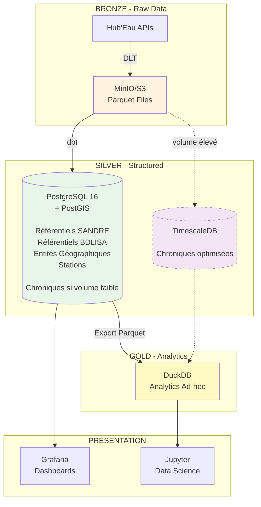

**Légende** :
- Trait plein : Composant de base
- Trait pointillé : Composant optionnel selon volume

---

### Décision Matrix Finale

| Type de Données | Volume | Stockage | Justification |
|----------------|--------|----------|---------------|
| **SANDRE Nomenclatures** | < 100k lignes | **PostgreSQL** | Lookups FK simples, hiérarchies 3-4 niveaux (CTEs récursives) |
| **BDLISA Formations** | < 10k lignes | **PostgreSQL + PostGIS** | Relations spatiales nécessaires (ST_Overlaps, ST_Contains) |
| **Stations** | < 50k lignes | **PostgreSQL + PostGIS** | Requêtes géospatiales (ST_DWithin, ST_Distance) |
| **Chroniques < 100M** | 10-100M lignes | **PostgreSQL natif** | Partitionnement natif PARTITION BY RANGE suffisant |
| **Chroniques > 100M** | 100M-1B+ lignes | **TimescaleDB** | Compression 10-20x, continuous aggregates, retention policies |
| **Bronze Raw** | TB | **MinIO/S3** | Object storage standard, compatible S3 API |
| **Analytics** | Ad-hoc | **DuckDB** | In-process, lecture directe Parquet, SQL standard |

---


## 📚 Référentiels Centraux

### SANDRE - Nomenclatures

```mermaid
erDiagram
    SANDRE_PARAMETRES {
        string code_parametre PK
        string libelle_parametre
        string uri_parametre
        string code_groupe_parametre FK
        string nature "physico-chimie, biologie, etc."
    }
    
    SANDRE_UNITES {
        string code_unite PK
        string symbole_unite "mg/L, °C, m³/s, etc."
        string libelle_unite
        string uri_unite
    }
    
    SANDRE_QUALIFICATIONS {
        string code_qualification PK
        string libelle_qualification "Correcte, Incertaine, Mauvaise, etc."
        int niveau_confiance "1-4"
    }
    
    SANDRE_SUPPORTS {
        string code_support PK
        string libelle_support "Eau, Sédiment, Biote, etc."
        string uri_support
    }
    
    SANDRE_METHODES {
        string code_methode PK
        string nom_methode
        string type_methode "analyse, prelevement, extraction, etc."
        string uri_methode
    }
    
    SANDRE_STATUTS {
        string code_statut PK
        string mnemo_statut
        string libelle_statut
    }
    
    SANDRE_TAXONS {
        string code_appel_taxon PK
        string libelle_appel_taxon "Nom scientifique"
        array codes_taxons_parents "Hiérarchie taxonomique"
        string rang_taxonomique "Espèce, Genre, Famille, etc."
    }
    
    SANDRE_GROUPES_PARAMETRES {
        string code_groupe_parametre PK
        string libelle_groupe_parametre "Nutriments, Métaux, Pesticides, etc."
        string uri_groupe_parametre
    }
    
    SANDRE_PARAMETRES }o--|| SANDRE_GROUPES_PARAMETRES : "appartient à"
```

### BDLISA - Formations Géologiques

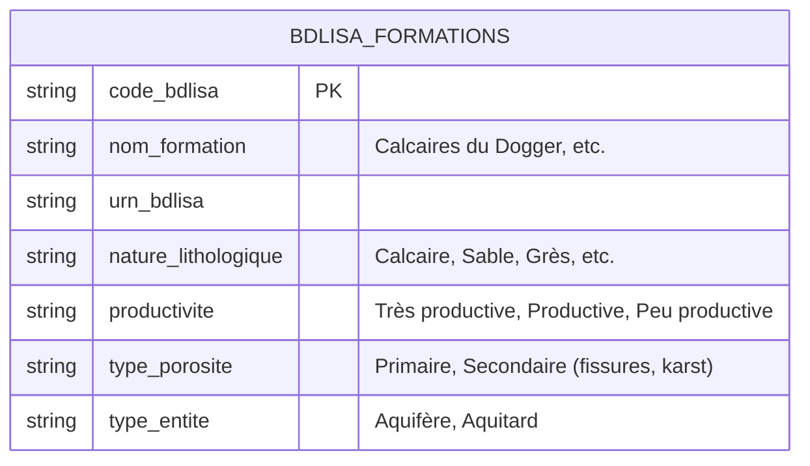

---

## 🗺️ Entités Géographiques

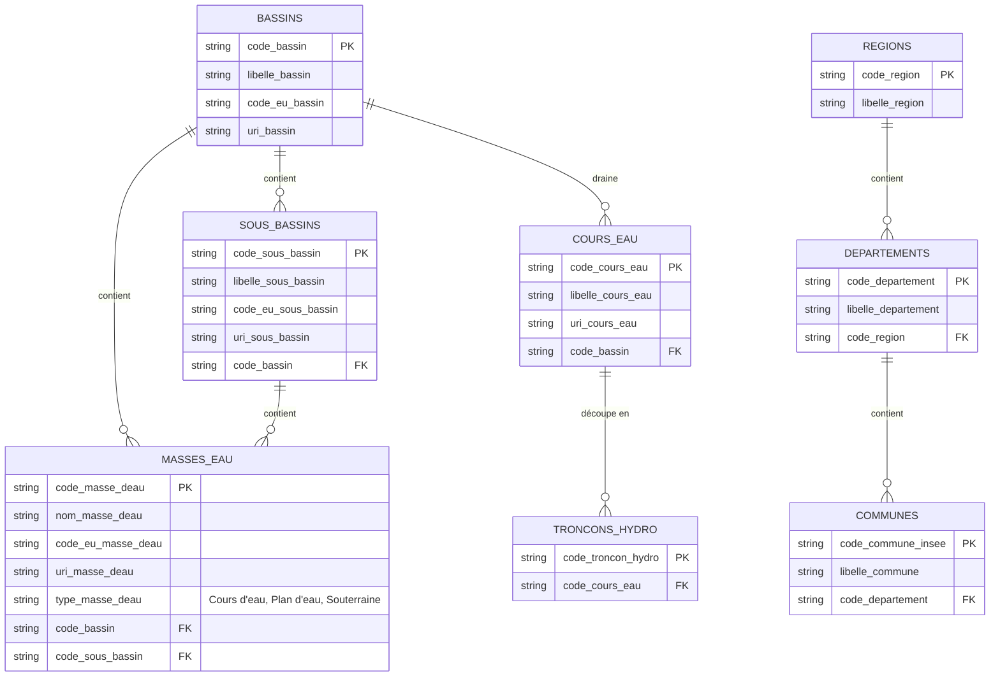

---

## 🌊 Schéma Hydrométrie

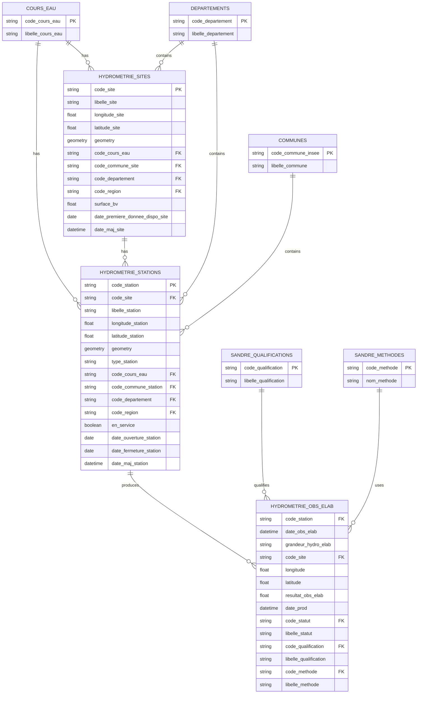

**Relations** :
- `HYDROMETRIE_STATIONS.code_site` → `HYDROMETRIE_SITES.code_site` (1:N)
- `HYDROMETRIE_OBS_ELAB.code_station` → `HYDROMETRIE_STATIONS.code_station` (1:N)
- `HYDROMETRIE_SITES.code_cours_eau` → `COURS_EAU.code_cours_eau`
- `HYDROMETRIE_STATIONS.code_departement` → `DEPARTEMENTS.code_departement`

---

## 💧 Schéma Piézométrie

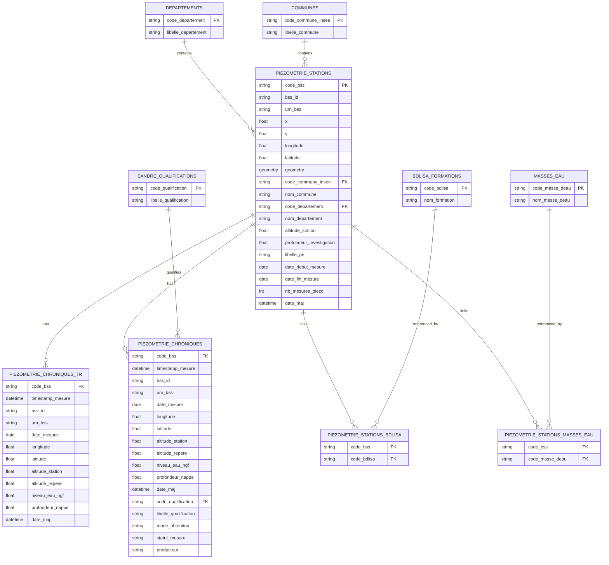

**Relations** :
- `PIEZOMETRIE_CHRONIQUES_TR.code_bss` → `PIEZOMETRIE_STATIONS.code_bss` (1:N)
- `PIEZOMETRIE_CHRONIQUES.code_bss` → `PIEZOMETRIE_STATIONS.code_bss` (1:N)
- `PIEZOMETRIE_STATIONS_BDLISA.code_bss` → `PIEZOMETRIE_STATIONS.code_bss` (N:N)
- `PIEZOMETRIE_STATIONS_BDLISA.code_bdlisa` → `BDLISA_FORMATIONS.code_bdlisa` (N:N)
- `PIEZOMETRIE_STATIONS_MASSES_EAU.code_masse_deau` → `MASSES_EAU.code_masse_deau` (N:N)

---

## 🧪 Schéma Qualité Cours d'Eau

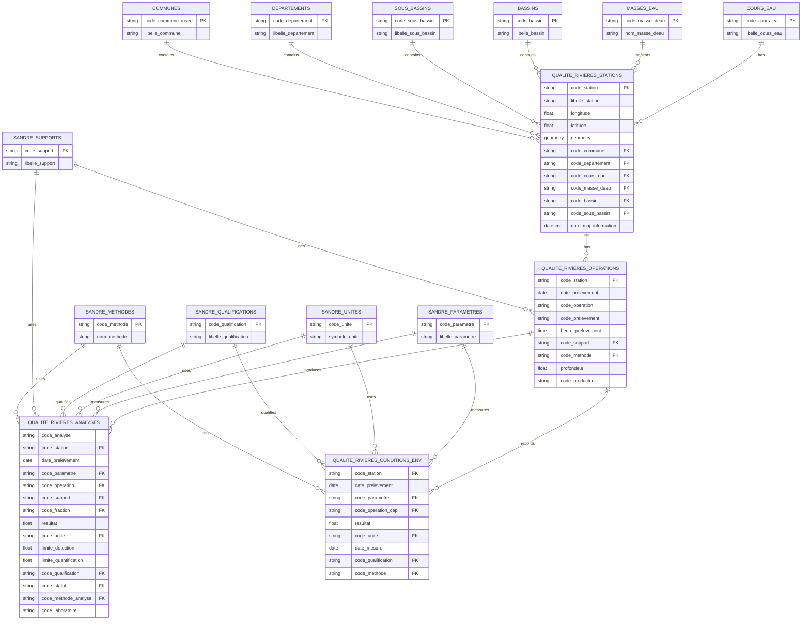

**Relations** :
- `QUALITE_RIVIERES_OPERATIONS.code_station` → `QUALITE_RIVIERES_STATIONS.code_station` (1:N)
- `QUALITE_RIVIERES_ANALYSES.{code_station, date_prelevement}` → `QUALITE_RIVIERES_OPERATIONS.{code_station, date_prelevement}` (1:N)
- `QUALITE_RIVIERES_CONDITIONS_ENV.{code_station, date_prelevement}` → `QUALITE_RIVIERES_OPERATIONS.{code_station, date_prelevement}` (1:N)
- `QUALITE_RIVIERES_ANALYSES.code_parametre` → `SANDRE_PARAMETRES.code_parametre`
- `QUALITE_RIVIERES_STATIONS.code_cours_eau` → `COURS_EAU.code_cours_eau`

---

## 🚰 Schéma Qualité Nappes

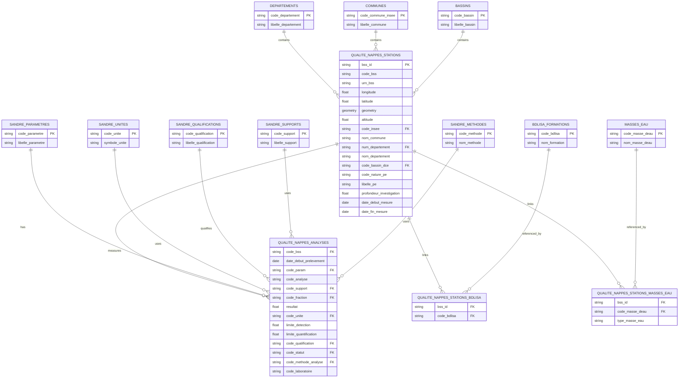

**Relations** :
- `QUALITE_NAPPES_ANALYSES.code_bss` → `QUALITE_NAPPES_STATIONS.code_bss` (1:N)
- `QUALITE_NAPPES_STATIONS_BDLISA.bss_id` → `QUALITE_NAPPES_STATIONS.bss_id` (N:N)
- `QUALITE_NAPPES_STATIONS_BDLISA.code_bdlisa` → `BDLISA_FORMATIONS.code_bdlisa` (N:N)
- `QUALITE_NAPPES_STATIONS_MASSES_EAU.code_masse_deau` → `MASSES_EAU.code_masse_deau` (N:N)

---

## 🌡️ Schéma Température

```mermaid
erDiagram
    TEMPERATURE_STATIONS {
        string code_station PK
        string libelle_station
        string uri_station
        float coordonnee_x
        float coordonnee_y
        string code_type_projection
        string libelle_type_projection
        float longitude
        float latitude
        geometry geometry
        float altitude
        float pk
        string localisation
        string code_commune FK
        string libelle_commune
        string code_departement FK
        string libelle_departement
        string code_region FK
        string libelle_region
        string code_troncon_hydro FK
        string code_cours_eau FK
        string libelle_cours_eau
        string uri_cours_eau
        string code_masse_eau FK
        string code_eu_masse_eau
        string libelle_masse_eau
        string uri_masse_eau
        string code_sous_bassin FK
        string libelle_sous_bassin
        string uri_sous_bassin
        string code_bassin FK
        string code_eu_bassin
        string libelle_bassin
        string uri_bassin
        float superficie_topo
        float superficie_reelle
        int premier_mois_etiage
        string nature_station
        string type_entite_hydro
        string commentaire
        date date_mise_en_service
        date date_mise_hors_service
        datetime date_maj_infos
    }
    
    TEMPERATURE_CHRONIQUES {
        string code_station FK
        datetime date_mesure_temp
        string libelle_station
        string uri_station
        string localisation
        float longitude
        float latitude
        geometry geometry
        string code_commune FK
        string libelle_commune
        string code_cours_eau FK
        string libelle_cours_eau
        string uri_cours_eau
        string code_parametre FK
        string libelle_parametre
        time heure_mesure_temp
        float resultat
        string code_unite FK
        string symbole_unite
        string code_qualification FK
        string libelle_qualification
    }
    
    COURS_EAU ||--o{ TEMPERATURE_STATIONS : "code_cours_eau"
    MASSES_EAU ||--o{ TEMPERATURE_STATIONS : "code_masse_eau"
    BASSINS ||--o{ TEMPERATURE_STATIONS : "code_bassin"
    SOUS_BASSINS ||--o{ TEMPERATURE_STATIONS : "code_sous_bassin"
    TRONCONS_HYDRO ||--o{ TEMPERATURE_STATIONS : "code_troncon_hydro"
    TEMPERATURE_STATIONS ||--o{ TEMPERATURE_CHRONIQUES : "code_station"
    TEMPERATURE_STATIONS }o--|| DEPARTEMENTS : "code_departement"
    TEMPERATURE_STATIONS }o--|| COMMUNES : "code_commune"
    TEMPERATURE_STATIONS }o--|| REGIONS : "code_region"
    TEMPERATURE_CHRONIQUES }o--|| SANDRE_PARAMETRES : "code_parametre"
    TEMPERATURE_CHRONIQUES }o--|| SANDRE_UNITES : "code_unite"
    TEMPERATURE_CHRONIQUES }o--|| SANDRE_QUALIFICATIONS : "code_qualification"
```

**Relations** :
- `TEMPERATURE_CHRONIQUES.code_station` → `TEMPERATURE_STATIONS.code_station` (1:N)
- `TEMPERATURE_STATIONS.code_cours_eau` → `COURS_EAU.code_cours_eau`
- `TEMPERATURE_STATIONS.code_masse_eau` → `MASSES_EAU.code_masse_deau` (Note: code_masse_eau dans API → code_masse_deau dans référentiel)
- `TEMPERATURE_CHRONIQUES.code_parametre` → `SANDRE_PARAMETRES.code_parametre`

---

## 🏞️ Schéma Écoulement

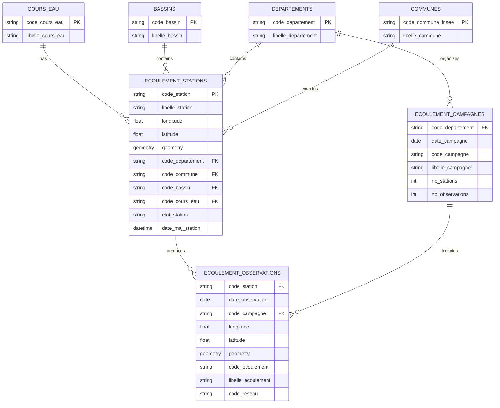

**Relations** :
- `ECOULEMENT_OBSERVATIONS.code_station` → `ECOULEMENT_STATIONS.code_station` (1:N)
- `ECOULEMENT_OBSERVATIONS.code_campagne` → `ECOULEMENT_CAMPAGNES.code_campagne` (1:N)
- `ECOULEMENT_CAMPAGNES.code_departement` → `DEPARTEMENTS.code_departement`
- `ECOULEMENT_STATIONS.code_cours_eau` → `COURS_EAU.code_cours_eau`

---

## 🐟 Schéma Hydrobiologie

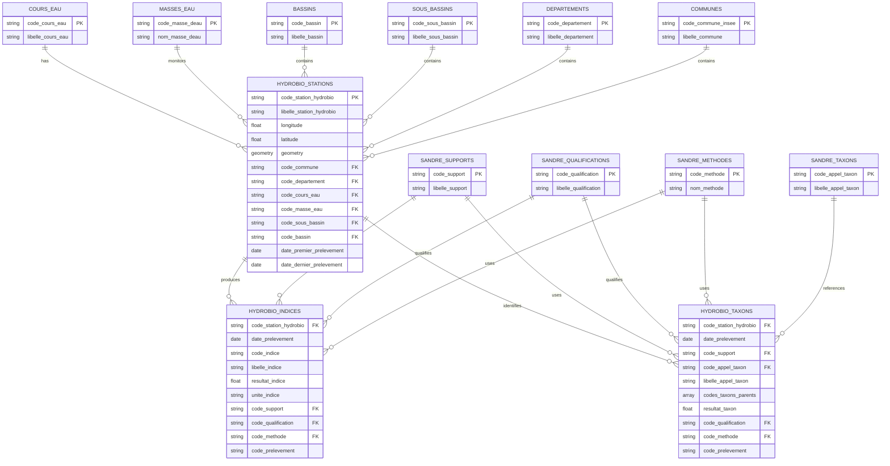

**Relations** :
- `HYDROBIO_INDICES.code_station_hydrobio` → `HYDROBIO_STATIONS.code_station_hydrobio` (1:N)
- `HYDROBIO_TAXONS.code_station_hydrobio` → `HYDROBIO_STATIONS.code_station_hydrobio` (1:N)
- `HYDROBIO_INDICES.{code_station_hydrobio, date_prelevement}` ≈ `HYDROBIO_TAXONS.{code_station_hydrobio, date_prelevement}` (même opération)
- `HYDROBIO_TAXONS.code_appel_taxon` → `SANDRE_TAXONS.code_appel_taxon`
- `HYDROBIO_STATIONS.code_cours_eau` → `COURS_EAU.code_cours_eau`

---

## 💦 Schéma Prélèvements

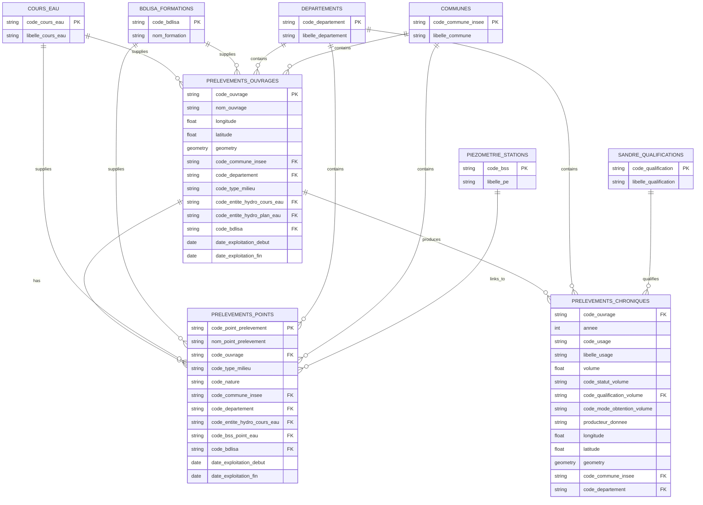

**Relations** :
- `PRELEVEMENTS_POINTS.code_ouvrage` → `PRELEVEMENTS_OUVRAGES.code_ouvrage` (1:N)
- `PRELEVEMENTS_CHRONIQUES.code_ouvrage` → `PRELEVEMENTS_OUVRAGES.code_ouvrage` (1:N)
- `PRELEVEMENTS_OUVRAGES.code_bdlisa` → `BDLISA_FORMATIONS.code_bdlisa`
- `PRELEVEMENTS_POINTS.code_bss_point_eau` → `PIEZOMETRIE_STATIONS.code_bss` (PONT SURFACE-SOUTERRAIN)
- `PRELEVEMENTS_OUVRAGES.code_entite_hydro_cours_eau` → `COURS_EAU.code_cours_eau`

---

## 🌐 Schéma Intégré Global

```mermaid
erDiagram
    %% RÉFÉRENTIELS
    SANDRE_PARAMETRES {
        string code_parametre PK
        string libelle_parametre
    }
    
    SANDRE_UNITES {
        string code_unite PK
        string symbole_unite
    }
    
    SANDRE_QUALIFICATIONS {
        string code_qualification PK
        string libelle_qualification
    }
    
    SANDRE_SUPPORTS {
        string code_support PK
        string libelle_support
    }
    
    SANDRE_METHODES {
        string code_methode PK
        string nom_methode
    }
    
    SANDRE_TAXONS {
        string code_appel_taxon PK
        string libelle_appel_taxon
    }
    
    BDLISA_FORMATIONS {
        string code_bdlisa PK
        string nom_formation
    }
    
    %% GÉOGRAPHIE
    COURS_EAU {
        string code_cours_eau PK
        string libelle_cours_eau
    }
    
    MASSES_EAU {
        string code_masse_deau PK
        string nom_masse_deau
        string type_masse_deau
    }
    
    BASSINS {
        string code_bassin PK
        string libelle_bassin
    }
    
    DEPARTEMENTS {
        string code_departement PK
        string libelle_departement
    }
    
    COMMUNES {
        string code_commune_insee PK
        string libelle_commune
        string code_departement FK
    }
    
    %% HYDROMÉTRIE
    HYDROMETRIE_SITES {
        string code_site PK
        string libelle_site
        string code_cours_eau FK
        string code_departement FK
    }
    
    HYDROMETRIE_STATIONS {
        string code_station PK
        string code_site FK
        string libelle_station
        string code_cours_eau FK
        string code_departement FK
    }
    
    HYDROMETRIE_OBS_ELAB {
        string code_station FK
        datetime date_obs_elab
        string grandeur_hydro_elab
        float resultat_obs_elab
        string code_qualification FK
    }
    
    %% PIÉZOMÉTRIE
    PIEZOMETRIE_STATIONS {
        string code_bss PK
        string libelle_pe
        string code_departement FK
    }
    
    PIEZOMETRIE_CHRONIQUES {
        string code_bss FK
        datetime timestamp_mesure
        float niveau_eau_ngf
        string code_qualification FK
    }
    
    PIEZOMETRIE_STATIONS_BDLISA {
        string code_bss FK
        string code_bdlisa FK
    }
    
    %% QUALITÉ RIVIÈRES
    QUALITE_RIVIERES_STATIONS {
        string code_station PK
        string libelle_station
        string code_cours_eau FK
        string code_masse_deau FK
        string code_departement FK
    }
    
    QUALITE_RIVIERES_OPERATIONS {
        string code_station FK
        date date_prelevement
        string code_operation
        string code_support FK
    }
    
    QUALITE_RIVIERES_ANALYSES {
        string code_station FK
        date date_prelevement
        string code_parametre FK
        float resultat
        string code_unite FK
        string code_qualification FK
        string code_support FK
    }
    
    %% QUALITÉ NAPPES
    QUALITE_NAPPES_STATIONS {
        string bss_id PK
        string code_bss
        string code_departement FK
    }
    
    QUALITE_NAPPES_ANALYSES {
        string code_bss FK
        date date_debut_prelevement
        string code_param FK
        float resultat
        string code_unite FK
        string code_qualification FK
    }
    
    QUALITE_NAPPES_STATIONS_BDLISA {
        string bss_id FK
        string code_bdlisa FK
    }
    
    %% TEMPÉRATURE
    TEMPERATURE_STATIONS {
        string code_station PK
        string libelle_station
        string code_cours_eau FK
        string code_masse_eau FK
        string code_departement FK
    }
    
    TEMPERATURE_CHRONIQUES {
        string code_station FK
        datetime date_mesure_temp
        float resultat
        string code_parametre FK
        string code_qualification FK
    }
    
    %% ÉCOULEMENT
    ECOULEMENT_STATIONS {
        string code_station PK
        string libelle_station
        string code_cours_eau FK
        string code_departement FK
    }
    
    ECOULEMENT_CAMPAGNES {
        string code_departement FK
        date date_campagne
        string code_campagne
    }
    
    ECOULEMENT_OBSERVATIONS {
        string code_station FK
        date date_observation
        string code_campagne FK
        string code_ecoulement
    }
    
    %% HYDROBIOLOGIE
    HYDROBIO_STATIONS {
        string code_station_hydrobio PK
        string libelle_station_hydrobio
        string code_cours_eau FK
        string code_masse_eau FK
        string code_departement FK
    }
    
    HYDROBIO_INDICES {
        string code_station_hydrobio FK
        date date_prelevement
        string code_indice
        float resultat_indice
        string code_support FK
        string code_qualification FK
    }
    
    HYDROBIO_TAXONS {
        string code_station_hydrobio FK
        date date_prelevement
        string code_appel_taxon FK
        float resultat_taxon
        string code_support FK
    }
    
    %% PRÉLÈVEMENTS
    PRELEVEMENTS_OUVRAGES {
        string code_ouvrage PK
        string nom_ouvrage
        string code_cours_eau FK
        string code_bdlisa FK
        string code_departement FK
    }
    
    PRELEVEMENTS_POINTS {
        string code_point_prelevement PK
        string code_ouvrage FK
        string code_bss_point_eau FK
    }
    
    PRELEVEMENTS_CHRONIQUES {
        string code_ouvrage FK
        int annee
        string code_usage
        float volume
    }
    
    %% RELATIONS RÉFÉRENTIELS
    SANDRE_PARAMETRES ||--o{ QUALITE_RIVIERES_ANALYSES : "code_parametre"
    SANDRE_PARAMETRES ||--o{ QUALITE_NAPPES_ANALYSES : "code_param"
    SANDRE_PARAMETRES ||--o{ TEMPERATURE_CHRONIQUES : "code_parametre"
    
    SANDRE_UNITES ||--o{ QUALITE_RIVIERES_ANALYSES : "code_unite"
    SANDRE_UNITES ||--o{ QUALITE_NAPPES_ANALYSES : "code_unite"
    
    SANDRE_QUALIFICATIONS ||--o{ HYDROMETRIE_OBS_ELAB : "code_qualification"
    SANDRE_QUALIFICATIONS ||--o{ PIEZOMETRIE_CHRONIQUES : "code_qualification"
    SANDRE_QUALIFICATIONS ||--o{ QUALITE_RIVIERES_ANALYSES : "code_qualification"
    SANDRE_QUALIFICATIONS ||--o{ QUALITE_NAPPES_ANALYSES : "code_qualification"
    SANDRE_QUALIFICATIONS ||--o{ TEMPERATURE_CHRONIQUES : "code_qualification"
    SANDRE_QUALIFICATIONS ||--o{ HYDROBIO_INDICES : "code_qualification"
    
    SANDRE_SUPPORTS ||--o{ QUALITE_RIVIERES_OPERATIONS : "code_support"
    SANDRE_SUPPORTS ||--o{ QUALITE_RIVIERES_ANALYSES : "code_support"
    SANDRE_SUPPORTS ||--o{ HYDROBIO_INDICES : "code_support"
    SANDRE_SUPPORTS ||--o{ HYDROBIO_TAXONS : "code_support"
    
    SANDRE_TAXONS ||--o{ HYDROBIO_TAXONS : "code_appel_taxon"
    
    BDLISA_FORMATIONS ||--o{ PIEZOMETRIE_STATIONS_BDLISA : "code_bdlisa"
    BDLISA_FORMATIONS ||--o{ QUALITE_NAPPES_STATIONS_BDLISA : "code_bdlisa"
    BDLISA_FORMATIONS ||--o{ PRELEVEMENTS_OUVRAGES : "code_bdlisa"
    
    %% RELATIONS GÉOGRAPHIQUES
    COURS_EAU ||--o{ HYDROMETRIE_SITES : "code_cours_eau"
    COURS_EAU ||--o{ HYDROMETRIE_STATIONS : "code_cours_eau"
    COURS_EAU ||--o{ QUALITE_RIVIERES_STATIONS : "code_cours_eau"
    COURS_EAU ||--o{ TEMPERATURE_STATIONS : "code_cours_eau"
    COURS_EAU ||--o{ ECOULEMENT_STATIONS : "code_cours_eau"
    COURS_EAU ||--o{ HYDROBIO_STATIONS : "code_cours_eau"
    COURS_EAU ||--o{ PRELEVEMENTS_OUVRAGES : "code_cours_eau"
    
    MASSES_EAU ||--o{ QUALITE_RIVIERES_STATIONS : "code_masse_deau"
    MASSES_EAU ||--o{ TEMPERATURE_STATIONS : "code_masse_eau"
    MASSES_EAU ||--o{ HYDROBIO_STATIONS : "code_masse_eau"
    
    DEPARTEMENTS ||--o{ COMMUNES : "code_departement"
    DEPARTEMENTS ||--o{ HYDROMETRIE_SITES : "code_departement"
    DEPARTEMENTS ||--o{ HYDROMETRIE_STATIONS : "code_departement"
    DEPARTEMENTS ||--o{ PIEZOMETRIE_STATIONS : "code_departement"
    DEPARTEMENTS ||--o{ QUALITE_RIVIERES_STATIONS : "code_departement"
    DEPARTEMENTS ||--o{ QUALITE_NAPPES_STATIONS : "code_departement"
    DEPARTEMENTS ||--o{ TEMPERATURE_STATIONS : "code_departement"
    DEPARTEMENTS ||--o{ ECOULEMENT_STATIONS : "code_departement"
    DEPARTEMENTS ||--o{ ECOULEMENT_CAMPAGNES : "code_departement"
    DEPARTEMENTS ||--o{ HYDROBIO_STATIONS : "code_departement"
    DEPARTEMENTS ||--o{ PRELEVEMENTS_OUVRAGES : "code_departement"
    
    %% RELATIONS HYDROMÉTRIE
    HYDROMETRIE_SITES ||--o{ HYDROMETRIE_STATIONS : "code_site"
    HYDROMETRIE_STATIONS ||--o{ HYDROMETRIE_OBS_ELAB : "code_station"
    
    %% RELATIONS PIÉZOMÉTRIE
    PIEZOMETRIE_STATIONS ||--o{ PIEZOMETRIE_CHRONIQUES : "code_bss"
    PIEZOMETRIE_STATIONS ||--o{ PIEZOMETRIE_STATIONS_BDLISA : "code_bss"
    
    %% RELATIONS QUALITÉ RIVIÈRES
    QUALITE_RIVIERES_STATIONS ||--o{ QUALITE_RIVIERES_OPERATIONS : "code_station"
    QUALITE_RIVIERES_OPERATIONS ||--o{ QUALITE_RIVIERES_ANALYSES : "code_station, date_prelevement"
    
    %% RELATIONS QUALITÉ NAPPES
    QUALITE_NAPPES_STATIONS ||--o{ QUALITE_NAPPES_ANALYSES : "code_bss"
    QUALITE_NAPPES_STATIONS ||--o{ QUALITE_NAPPES_STATIONS_BDLISA : "bss_id"
    
    %% RELATIONS TEMPÉRATURE
    TEMPERATURE_STATIONS ||--o{ TEMPERATURE_CHRONIQUES : "code_station"
    
    %% RELATIONS ÉCOULEMENT
    ECOULEMENT_STATIONS ||--o{ ECOULEMENT_OBSERVATIONS : "code_station"
    ECOULEMENT_CAMPAGNES ||--o{ ECOULEMENT_OBSERVATIONS : "code_campagne"
    
    %% RELATIONS HYDROBIOLOGIE
    HYDROBIO_STATIONS ||--o{ HYDROBIO_INDICES : "code_station_hydrobio"
    HYDROBIO_STATIONS ||--o{ HYDROBIO_TAXONS : "code_station_hydrobio"
    
    %% RELATIONS PRÉLÈVEMENTS
    PRELEVEMENTS_OUVRAGES ||--o{ PRELEVEMENTS_POINTS : "code_ouvrage"
    PRELEVEMENTS_OUVRAGES ||--o{ PRELEVEMENTS_CHRONIQUES : "code_ouvrage"
    PRELEVEMENTS_POINTS }o--|| PIEZOMETRIE_STATIONS : "code_bss_point_eau"
```

---

## 📋 Tables de Référence Complètes

### Tableau Récapitulatif des Clés Primaires

| Domaine | Table | Clé Primaire | Type | Replication Key |
|---------|-------|-------------|------|-----------------|
| **Référentiels** | `SANDRE_PARAMETRES` | `code_parametre` | string | - |
| | `SANDRE_UNITES` | `code_unite` | string | - |
| | `SANDRE_QUALIFICATIONS` | `code_qualification` | string | - |
| | `SANDRE_SUPPORTS` | `code_support` | string | - |
| | `SANDRE_METHODES` | `code_methode` | string | - |
| | `SANDRE_TAXONS` | `code_appel_taxon` | string | - |
| | `BDLISA_FORMATIONS` | `code_bdlisa` | string | - |
| **Géographie** | `COURS_EAU` | `code_cours_eau` | string | - |
| | `MASSES_EAU` | `code_masse_deau` | string | - |
| | `BASSINS` | `code_bassin` | string | - |
| | `SOUS_BASSINS` | `code_sous_bassin` | string | - |
| | `DEPARTEMENTS` | `code_departement` | string | - |
| | `COMMUNES` | `code_commune_insee` | string | - |
| | `REGIONS` | `code_region` | string | - |
| **Hydrométrie** | `HYDROMETRIE_SITES` | `code_site` | string | `date_maj_site` |
| | `HYDROMETRIE_STATIONS` | `code_station` | string | `date_maj_station` |
| | `HYDROMETRIE_OBS_ELAB` | `[code_station, date_obs_elab, grandeur_hydro_elab]` | composite | - |
| **Piézométrie** | `PIEZOMETRIE_STATIONS` | `code_bss` | string | `date_maj` |
| | `PIEZOMETRIE_CHRONIQUES_TR` | `[code_bss, timestamp_mesure]` | composite | - |
| | `PIEZOMETRIE_CHRONIQUES` | `[code_bss, timestamp_mesure]` | composite | - |
| **Qualité Rivières** | `QUALITE_RIVIERES_STATIONS` | `code_station` | string | `date_maj_information` |
| | `QUALITE_RIVIERES_OPERATIONS` | `[code_station, date_prelevement, code_operation]` | composite | - |
| | `QUALITE_RIVIERES_ANALYSES` | `[code_station, date_prelevement, code_parametre]` | composite | - |
| | `QUALITE_RIVIERES_CONDITIONS_ENV` | `[code_station, date_prelevement, code_parametre]` | composite | - |
| **Qualité Nappes** | `QUALITE_NAPPES_STATIONS` | `bss_id` (= `code_bss`) | string | - |
| | `QUALITE_NAPPES_ANALYSES` | `[code_bss, date_debut_prelevement, code_param]` | composite | - |
| **Température** | `TEMPERATURE_STATIONS` | `code_station` | string | `date_maj_infos` |
| | `TEMPERATURE_CHRONIQUES` | `[code_station, date_mesure_temp]` | composite | - |
| **Écoulement** | `ECOULEMENT_STATIONS` | `code_station` | string | `date_maj_station` |
| | `ECOULEMENT_CAMPAGNES` | `[code_departement, date_campagne]` | composite | - |
| | `ECOULEMENT_OBSERVATIONS` | `[code_station, date_observation]` | composite | - |
| **Hydrobiologie** | `HYDROBIO_STATIONS` | `code_station_hydrobio` | string | - |
| | `HYDROBIO_INDICES` | `[code_station_hydrobio, date_prelevement, code_indice]` | composite | - |
| | `HYDROBIO_TAXONS` | `[code_station_hydrobio, date_prelevement, code_support]` | composite | - |
| **Prélèvements** | `PRELEVEMENTS_OUVRAGES` | `code_ouvrage` | string | - |
| | `PRELEVEMENTS_POINTS` | `code_point_prelevement` | string | - |
| | `PRELEVEMENTS_CHRONIQUES` | `[code_ouvrage, annee, code_usage]` | composite | - |

### Tableau des Clés Étrangères

| Table Source | Champ FK | Table Destination | Champ PK | Cardinalité |
|--------------|----------|-------------------|----------|-------------|
| **HYDROMETRIE_STATIONS** | `code_site` | HYDROMETRIE_SITES | `code_site` | N:1 |
| **HYDROMETRIE_OBS_ELAB** | `code_station` | HYDROMETRIE_STATIONS | `code_station` | N:1 |
| **HYDROMETRIE_STATIONS** | `code_cours_eau` | COURS_EAU | `code_cours_eau` | N:1 |
| **HYDROMETRIE_STATIONS** | `code_departement` | DEPARTEMENTS | `code_departement` | N:1 |
| **HYDROMETRIE_OBS_ELAB** | `code_qualification` | SANDRE_QUALIFICATIONS | `code_qualification` | N:1 |
| **PIEZOMETRIE_CHRONIQUES** | `code_bss` | PIEZOMETRIE_STATIONS | `code_bss` | N:1 |
| **PIEZOMETRIE_STATIONS_BDLISA** | `code_bss` | PIEZOMETRIE_STATIONS | `code_bss` | N:1 |
| **PIEZOMETRIE_STATIONS_BDLISA** | `code_bdlisa` | BDLISA_FORMATIONS | `code_bdlisa` | N:1 |
| **PIEZOMETRIE_STATIONS** | `code_departement` | DEPARTEMENTS | `code_departement` | N:1 |
| **PIEZOMETRIE_CHRONIQUES** | `code_qualification` | SANDRE_QUALIFICATIONS | `code_qualification` | N:1 |
| **QUALITE_RIVIERES_OPERATIONS** | `code_station` | QUALITE_RIVIERES_STATIONS | `code_station` | N:1 |
| **QUALITE_RIVIERES_ANALYSES** | `code_station` | QUALITE_RIVIERES_STATIONS | `code_station` | N:1 |
| **QUALITE_RIVIERES_ANALYSES** | `code_parametre` | SANDRE_PARAMETRES | `code_parametre` | N:1 |
| **QUALITE_RIVIERES_ANALYSES** | `code_unite` | SANDRE_UNITES | `code_unite` | N:1 |
| **QUALITE_RIVIERES_ANALYSES** | `code_qualification` | SANDRE_QUALIFICATIONS | `code_qualification` | N:1 |
| **QUALITE_RIVIERES_ANALYSES** | `code_support` | SANDRE_SUPPORTS | `code_support` | N:1 |
| **QUALITE_RIVIERES_STATIONS** | `code_cours_eau` | COURS_EAU | `code_cours_eau` | N:1 |
| **QUALITE_RIVIERES_STATIONS** | `code_masse_deau` | MASSES_EAU | `code_masse_deau` | N:1 |
| **QUALITE_RIVIERES_STATIONS** | `code_departement` | DEPARTEMENTS | `code_departement` | N:1 |
| **QUALITE_NAPPES_ANALYSES** | `code_bss` | QUALITE_NAPPES_STATIONS | `code_bss` | N:1 |
| **QUALITE_NAPPES_ANALYSES** | `code_param` | SANDRE_PARAMETRES | `code_parametre` | N:1 |
| **QUALITE_NAPPES_ANALYSES** | `code_qualification` | SANDRE_QUALIFICATIONS | `code_qualification` | N:1 |
| **QUALITE_NAPPES_STATIONS_BDLISA** | `bss_id` | QUALITE_NAPPES_STATIONS | `bss_id` | N:1 |
| **QUALITE_NAPPES_STATIONS_BDLISA** | `code_bdlisa` | BDLISA_FORMATIONS | `code_bdlisa` | N:1 |
| **QUALITE_NAPPES_STATIONS** | `code_departement` | DEPARTEMENTS | `code_departement` | N:1 |
| **TEMPERATURE_CHRONIQUES** | `code_station` | TEMPERATURE_STATIONS | `code_station` | N:1 |
| **TEMPERATURE_CHRONIQUES** | `code_parametre` | SANDRE_PARAMETRES | `code_parametre` | N:1 |
| **TEMPERATURE_CHRONIQUES** | `code_qualification` | SANDRE_QUALIFICATIONS | `code_qualification` | N:1 |
| **TEMPERATURE_STATIONS** | `code_cours_eau` | COURS_EAU | `code_cours_eau` | N:1 |
| **TEMPERATURE_STATIONS** | `code_masse_eau` | MASSES_EAU | `code_masse_deau` | N:1 |
| **TEMPERATURE_STATIONS** | `code_departement` | DEPARTEMENTS | `code_departement` | N:1 |
| **ECOULEMENT_OBSERVATIONS** | `code_station` | ECOULEMENT_STATIONS | `code_station` | N:1 |
| **ECOULEMENT_OBSERVATIONS** | `code_campagne` | ECOULEMENT_CAMPAGNES | `code_campagne` | N:1 |
| **ECOULEMENT_CAMPAGNES** | `code_departement` | DEPARTEMENTS | `code_departement` | N:1 |
| **ECOULEMENT_STATIONS** | `code_cours_eau` | COURS_EAU | `code_cours_eau` | N:1 |
| **ECOULEMENT_STATIONS** | `code_departement` | DEPARTEMENTS | `code_departement` | N:1 |
| **HYDROBIO_INDICES** | `code_station_hydrobio` | HYDROBIO_STATIONS | `code_station_hydrobio` | N:1 |
| **HYDROBIO_TAXONS** | `code_station_hydrobio` | HYDROBIO_STATIONS | `code_station_hydrobio` | N:1 |
| **HYDROBIO_TAXONS** | `code_appel_taxon` | SANDRE_TAXONS | `code_appel_taxon` | N:1 |
| **HYDROBIO_INDICES** | `code_support` | SANDRE_SUPPORTS | `code_support` | N:1 |
| **HYDROBIO_INDICES** | `code_qualification` | SANDRE_QUALIFICATIONS | `code_qualification` | N:1 |
| **HYDROBIO_STATIONS** | `code_cours_eau` | COURS_EAU | `code_cours_eau` | N:1 |
| **HYDROBIO_STATIONS** | `code_masse_eau` | MASSES_EAU | `code_masse_deau` | N:1 |
| **HYDROBIO_STATIONS** | `code_departement` | DEPARTEMENTS | `code_departement` | N:1 |
| **PRELEVEMENTS_POINTS** | `code_ouvrage` | PRELEVEMENTS_OUVRAGES | `code_ouvrage` | N:1 |
| **PRELEVEMENTS_CHRONIQUES** | `code_ouvrage` | PRELEVEMENTS_OUVRAGES | `code_ouvrage` | N:1 |
| **PRELEVEMENTS_OUVRAGES** | `code_bdlisa` | BDLISA_FORMATIONS | `code_bdlisa` | N:1 |
| **PRELEVEMENTS_OUVRAGES** | `code_cours_eau` | COURS_EAU | `code_cours_eau` | N:1 |
| **PRELEVEMENTS_OUVRAGES** | `code_departement` | DEPARTEMENTS | `code_departement` | N:1 |
| **PRELEVEMENTS_POINTS** | `code_bss_point_eau` | PIEZOMETRIE_STATIONS | `code_bss` | N:1 ⚡ |

**⚡ = Pont Surface-Souterrain**

### Clés Communes Multi-APIs

| Clé | Présence | Type | Rôle |
|-----|----------|------|------|
| **`code_cours_eau`** | Hydrométrie, Qualité Riv., Température, Écoulement, Hydrobiologie, Prélèvements | string | Pivot eaux de surface |
| **`code_masse_deau`** | Qualité Riv., Qualité Nappes, Température, Hydrobiologie | string | Pivot DCE |
| **`code_departement`** | **TOUTES** les APIs | string | Pivot administratif |
| **`code_commune_insee`** | **TOUTES** les APIs | string | Localisation fine |
| **`code_bassin`** | Hydrométrie, Qualité Riv., Température, Écoulement, Hydrobiologie, Qualité Nappes | string | Découpage hydrographique |
| **`code_bss`** | Piézométrie, Qualité Nappes, Prélèvements (via points) | string | Pivot souterrain |
| **`code_bdlisa`** | Piézométrie, Qualité Nappes, Prélèvements | string | Pivot géologique |
| **`code_qualification`** | Hydrométrie, Piézométrie, Qualité Riv., Qualité Nappes, Température, Hydrobiologie | string | Qualité donnée |
| **`code_parametre`** | Qualité Riv., Qualité Nappes, Température | string | Paramètre mesuré |
| **`code_support`** | Qualité Riv., Hydrobiologie | string | Support prélèvement |

---

## 🎯 Synthèse

### Référentiels Pivots

1. **SANDRE** → Normalise **TOUTES** les APIs
   - Paramètres, unités, qualifications, supports, méthodes, taxons

2. **BDLISA** → Connecte les eaux souterraines
   - Piézométrie, Qualité Nappes, Prélèvements

3. **Cours d'Eau** → Connecte les eaux de surface
   - Hydrométrie, Qualité Rivières, Température, Écoulement, Hydrobiologie, Prélèvements

4. **Département** → Pivot administratif universel
   - **TOUTES** les 8 APIs

### Ponts Inter-Domaines

| Pont | Via | Connexion |
|------|-----|-----------|
| **Surface ↔ Souterrain** | `PRELEVEMENTS_POINTS.code_bss_point_eau` | Prélèvements → Piézométrie |
| **Hydrométrie ↔ Qualité** | `code_cours_eau` | Jointure possible par cours d'eau |
| **Piézométrie ↔ Qualité Nappes** | `code_bss` | Même point d'eau (BSS) |
| **Toutes APIs ↔ SANDRE** | `code_qualification`, `code_parametre`, etc. | Normalisation universelle |

### Structure de Données

- **23 tables référentiels** (SANDRE + BDLISA + Géographie)
- **31 tables métier** (Stations + Données/Chroniques)
- **5 tables de liaison** (N:N pour arrays)
- **Total : 59 tables**

**Résultat** : Modèle relationnel complet, normalisé et navigable du système Hub'Eau 🌊
