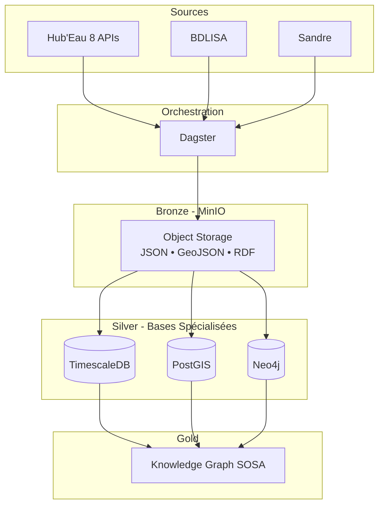

# Architecture Technique

Infrastructure, technologies et choix d'implémentation

---

## Vue d'Ensemble



---

## Stack Technologique

| Couche | Technologie | Version | Rôle |
|--------|-------------|---------|------|
| Orchestration | Dagster | 1.5+ | Assets, jobs, schedules |
| Client HTTP | httpx | 0.24+ | Client async |
| Retry | tenacity | 8.2+ | Gestion erreurs |
| Validation | pydantic | 2.0+ | Validation données |
| Bronze | MinIO | Latest | Object Storage S3 |
| Time Series | TimescaleDB | 2.14+ | Séries temporelles |
| Geospatial | PostGIS | 3.4+ | Analyses spatiales |
| Graph | Neo4j | 5.15 | Graphe sémantique |
| Infrastructure | Docker Compose | 2.20+ | Multi-container |
| Admin | pgAdmin | Latest | Interface PostgreSQL |

---

## Architecture Docker

### Services

```yaml
services:
  dagster_webserver:    # Port 8080
  dagster_daemon:       # Background
  timescaledb:          # Port 5432
  postgis:              # Port 5433
  neo4j:                # Ports 7474, 7687
  minio:                # Ports 9000, 9001
  pgadmin:              # Port 5050
```

### Volumes

```yaml
volumes:
  timescale_data:       # Séries temporelles
  postgis_data:         # Géospatial
  neo4j_data:           # Graphe
  minio_data:           # Object storage
  pgadmin_data:         # Config pgAdmin
  dagster_home:         # Config Dagster
```

### Scripts d'Initialisation

```
docker/init-scripts/
├── timescaledb/
│   ├── 01-init-water-timeseries.sql
│   └── 02-create-hypertables.sql
├── postgis/
│   ├── 01-init-water-geo.sql
│   └── 02-create-functions.sql
└── neo4j/
    ├── 01-init-sandre-sosa.cypher
    ├── 02-create-sandre-data.cypher
    └── 03-create-relations-sosa.cypher
```

---

## Bronze Layer : MinIO

### Organisation

```
bronze/
  ├── hydrometry/2024-09-15/
  ├── piezometry/2024-09-15/
  ├── temperature/2024-08-15/
  ├── bdlisa/
  └── sandre/

silver/
  └── (données transformées)

gold/
  └── (agrégations)
```

### Caractéristiques

- S3-compatible (migration cloud facile)
- Stockage distribué
- Formats multiples (JSON, GeoJSON, RDF)
- Cache données existantes

---

## Silver Layer : Bases Spécialisées

### TimescaleDB

**Base** : `water_timeseries`  
**Port** : 5432

**Fonctionnalités** :
- Hypertables (partitioning automatique par temps)
- Compression automatique (90% réduction)
- Continuous aggregates
- Compatible PostgreSQL

**Exemple** :
```sql
CREATE TABLE observations (
    timestamp TIMESTAMPTZ NOT NULL,
    station_code TEXT,
    parametre_code TEXT,
    valeur DOUBLE PRECISION
);

SELECT create_hypertable('observations', 'timestamp');
```

### PostGIS

**Base** : `water_geo`  
**Port** : 5433

**Fonctionnalités** :
- Index GIST (requêtes spatiales rapides)
- Fonctions géométriques avancées
- Standards OGC (WFS, WMS)
- Formats multiples (WKT, WKB, GeoJSON)

**Exemple** :
```sql
CREATE TABLE stations_geo (
    station_code TEXT PRIMARY KEY,
    nom TEXT,
    geom GEOMETRY(Point, 4326)
);

CREATE INDEX idx_stations_geom ON stations_geo USING GIST(geom);
```

### Neo4j

**Base** : `neo4j`  
**Ports** : 7474 (HTTP), 7687 (Bolt)

**Fonctionnalités** :
- Traversals graphe (performance linéaire)
- Schéma flexible
- APOC (extensions)
- Cypher (langage requêtes)

**Exemple** :
```cypher
CREATE CONSTRAINT station_code FOR (s:Station) 
REQUIRE s.code IS UNIQUE;

(:Station)-[:OBSERVES]->(:Property)
(:Station)-[:LOCATED_IN]->(:Aquifer)
```

---

## Choix Architecturaux

### Dagster vs Airflow

| Aspect | Airflow | Dagster |
|--------|---------|---------|
| Paradigme | DAG (tasks) | Asset (données) |
| Type Safety | Faible | Fort |
| Testing | Complexe | Intégré |
| Partitions | Manuel | Natif |
| Backfilling | Complexe | Simple |

### httpx vs requests

| Feature | requests | httpx |
|---------|----------|-------|
| Async | ❌ | ✅ |
| HTTP/2 | ❌ | ✅ |
| Timeouts | Basiques | Granulaires |
| Type Hints | Partiels | Complets |

### 3 Bases vs 1 Base

**Pourquoi 3 bases spécialisées ?**

| Requête | Base | Raison |
|---------|------|--------|
| Moyenne température 1 an | TimescaleDB | Hypertables + compression |
| Stations à 5km | PostGIS | Index GIST + géométrie |
| Paramètres liés qualité | Neo4j | Traversal graphe |

**Performances** :
- TimescaleDB : 1000x plus rapide que PostgreSQL pour agrégations temporelles
- PostGIS : 100x plus rapide pour requêtes spatiales
- Neo4j : Performance linéaire vs exponentielle SQL pour graphe

---

## Pipeline Dagster

### Assets

```python
@asset(
    partitions_def=DAILY_PARTITIONS,
    group_name="bronze_hubeau",
    required_resource_keys={"s3"},
    tags={"api": "hubeau"}
)
async def hubeau_piezometry_bronze(context: AssetExecutionContext):
    return await ingest_hubeau_api(context, "piezometry")
```

### Jobs

```python
hubeau_bronze_job = define_asset_job(
    name="hubeau_bronze_job",
    selection=[
        "hubeau_piezometry_bronze",
        "hubeau_temperature_bronze",
        # ...
    ]
)
```

### Schedules

```python
@schedule(
    job=hubeau_bronze_job,
    cron_schedule="0 6 * * *"  # Tous les jours à 6h
)
def hubeau_daily_schedule(context):
    return RunRequest()
```

---

## Limitation de Concurrence

### Configuration

**dagster_home/dagster.yaml** :
```yaml
run_coordinator:
  module: dagster.core.run_coordinator
  class: QueuedRunCoordinator
  config:
    max_concurrent_runs: 2
    tag_concurrency_limits:
      - key: "api"
        value: "hubeau"
        limit: 1
```

### Comportement

- Tag `api: hubeau` sur tous les assets Hub'Eau
- Maximum 1 partition à la fois
- Protection API Hub'Eau contre surcharge

---

## Client HTTP

### Retry Automatique

```python
from tenacity import retry, stop_after_attempt, wait_exponential

@retry(
    stop=stop_after_attempt(5),
    wait=wait_exponential(multiplier=1, min=2, max=60)
)
async def fetch_data(url: str, params: dict):
    async with httpx.AsyncClient(timeout=30.0) as client:
        response = await client.get(url, params=params)
        response.raise_for_status()
        return response.json()
```

**Paramètres** :
- 5 tentatives max
- Backoff : 2s, 4s, 8s, 16s, 32s
- Timeout : 30s par requête

### Gestion Erreurs

| Code | Action |
|------|--------|
| 400 | Retry (dates invalides) |
| 500 | Retry (surcharge serveur) |
| Timeout | Retry |
| 200 | Succès |

---

## Sécurité

### Contrôle d'Accès

```sql
-- PostgreSQL/TimescaleDB/PostGIS
CREATE USER dagster_service WITH PASSWORD 'xxx';
GRANT INSERT, SELECT, UPDATE ON ALL TABLES TO dagster_service;

CREATE USER analyst_readonly WITH PASSWORD 'xxx';
GRANT SELECT ON ALL TABLES TO analyst_readonly;
```

```cypher
// Neo4j
CREATE USER analyst_readonly SET PASSWORD 'xxx';
GRANT ROLE reader TO analyst_readonly;
```

### Backup

```bash
# TimescaleDB
pg_dump -U postgres -d water_timeseries > backup.sql

# PostGIS
pg_dump -U postgres -d water_geo > backup.sql

# Neo4j
docker exec neo4j neo4j-admin database dump water_graph

# MinIO
mc mirror minio/bronze /backups/bronze
```

---

## Déploiement

### Installation

```bash
git clone <repo>
cd brgm
cp env.example .env
docker-compose up -d
```

### Vérification

```bash
docker-compose ps
curl http://localhost:8080/health
```

### Maintenance

```bash
# Logs
docker-compose logs -f dagster_webserver

# Status
docker-compose ps

# Espace disque
docker system df
```

---

## Références

- [Dagster Documentation](https://docs.dagster.io/)
- [httpx](https://www.python-httpx.org/)
- [TimescaleDB](https://docs.timescale.com/)
- [PostGIS](https://postgis.net/documentation/)
- [Neo4j](https://neo4j.com/docs/)
- [MinIO](https://min.io/docs/minio/linux/index.html)

---

**Version** : 2.0  
**Dernière mise à jour** : Septembre 2025

